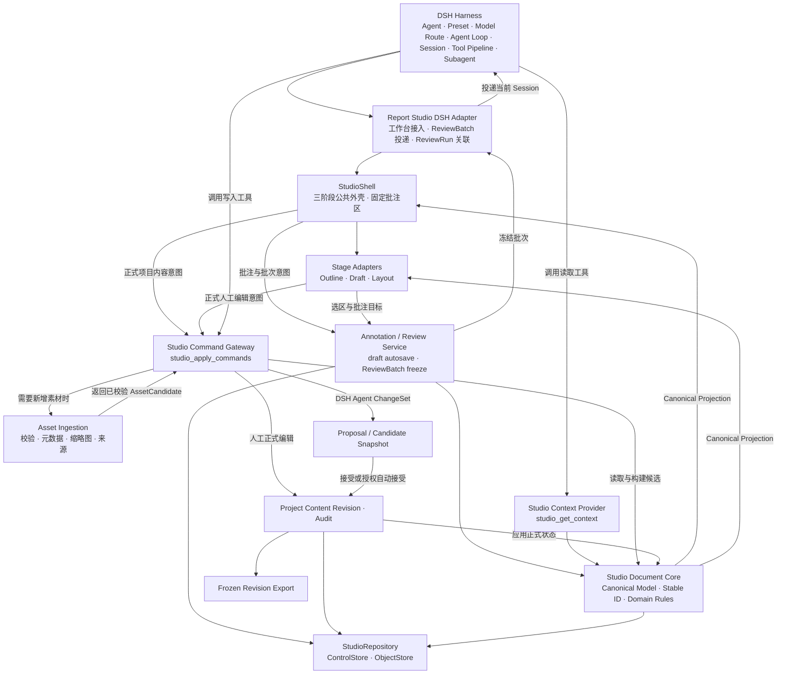

# 通用汇报工作台架构开发文档

> 本文件是本项目唯一的架构母文件。后续确认的架构、数据、交互和技术决策持续更新到本文件，不另建平行的“v2 / v3 架构文件”。文档头记录当前版本，末尾保留变更记录。

> **当前生产基线：`1.1.0`，对应 Report Studio `v0.1.1`。** `1.0.0` 是开发前冻结版；`1.1.0` 记录已经实现并验证的 A1.1 迁移、Revision CAS、冻结评审上下文、标准项目 Adapter 和部署边界。后续改变已稳定规则必须新增 ADR 并提升文档版本。

## 0. 文档使用规则

### 0.1 状态标记

- **已稳定**：开发必须遵循，除非明确发起架构变更。
- **首选实现**：第一版按该技术实现，但该实现不得成为不可替换的领域事实源。
- **待验证**：方向合理，需要样机、兼容性或性能验证后才能转为已稳定。
- **待讨论**：尚未形成决定，开发者不得在局部代码中自行固化。
- **暂缓**：当前版本明确不做，但需保留扩展边界。

### 0.2 架构原则【已稳定】

1. 产品是通用的按页汇报内容生产与排版平台，不绑定“前期策划”或任何单一业务。
2. 前期策划、BIM 汇报、技术方案、论文答辩等均属于上层模板、规则包或内容能力，不进入平台核心领域模型。
3. DSH Harness 是唯一的智能执行面，负责 Agent、Agent Preset、模型与 Provider 路由、Agent Loop、工具调用、子 Agent、Session 日志、取消与恢复。
4. Report Studio 不自建第二套 Agent Runtime，不固定模型，不由 UI 直接调用模型，也不让排版引擎内置的 AI / MCP 形成第二条智能执行链。正式产品入口是 DSH Web 根地址 `http://127.0.0.1:3080/`；Report Studio 通过当前 Session 的 `conversation.view` 呈现。模型、推理等级、Session 与消息输入留在 DSH 原生外壳，`/report-studio` 只承担同源 iframe/独立工作台内容与 API，不构成第二套应用外壳。
5. Report Studio 负责结构化业务事实：项目、大纲、页面、草案、素材、排版、批注、ReviewBatch、Proposal、Revision、审计与导出。
6. 人工界面、DSH Agent 工具和导出器围绕同一套 Canonical Model 工作；Tiptap、OpenPencil 或其他编辑器都只是 Adapter 后的交互与渲染实现。
7. 所有可被选择、批注、修改、引用、同步或导出的对象都必须拥有稳定且类型明确的 ID。
8. DSH Agent 不读取 DOM、React 状态、数据库表、编辑器私有 JSON 或未经筛选的整个项目；它读取平台生成的结构化语义投影。
9. DSH Agent 不覆盖整份项目或整页文档；它通过 Studio 工具提交使用稳定 ID 的领域 Command。
10. 批注是平台级独立数据，不嵌死在大纲组件、Tiptap 或排版引擎内部。
11. 三个阶段共用同一项目、同一页面身份、同一素材体系、同一 Revision 体系和同一固定右侧批注区。
12. 顶部“大纲 / 草案 / 排版”是工作视图，不是全项目唯一阶段状态；真实进度由大纲节点、草案页和排版页的对象级状态表达。
13. 草案是页面语义内容的事实源；排版文档是视觉布局事实源。两者通过 `sourceRef` 关联，而不是复制后失联。
14. `live` 绑定的草案内容与本页素材在正式提交后自动同步到排版，保留排版几何和样式；排版中修改 `live` 内容必须回写同页草案源。
15. 项目内容使用一条项目级单调 Revision；批注自动暂存、ReviewRun 交付状态和待确认 Proposal 状态使用各自版本或状态，不得无意义地推动项目内容 Revision。
16. 导出成果必须来自一个冻结的正式 Revision；候选预览、编辑器临时状态和未提交批注不能直接进入最终导出。
17. 所有模型可见的任务信封、结构化上下文、Artifact Reference 和工具结果都必须通过 DSH 支持的 Session / Tool 事件进入可追溯执行记录；不得使用无法重放的隐藏上下文通道。
18. MVP Command v0.1 采用对象级领域命令与三级风险策略：普通可逆操作完整支持；结构性操作只能生成候选并整轮确认；跨页重组、永久删除和整页覆盖不进入默认 `allowedCommands`，仅能通过显式受保护任务启用或继续暂缓。
19. MVP 本地持久化采用“DSH 原生控制存储 + Studio 不可变对象存储”双层结构：小型可变控制记录进入 DSH Storage Domain，Canonical Snapshot、素材和派生成果进入内容寻址对象存储。
20. 正式 Revision 同时保存完整 Canonical Snapshot 引用、已接受 ChangeSet、审计来源和完整性哈希；当前状态直接从最新 Snapshot 读取，不依赖从零重放命令日志。
21. 项目正式可见状态只由 `ProjectHeadRecord` 指向的 Revision 决定。提交时先持久化全部不可变对象，再以 `baseRevision` 做原子 Head 更新；Head 更新前产生的孤儿对象不可见且可回收。
22. Report Studio 不依赖 DSH Storage Domain 的跨记录事务；所有跨介质写入采用“不可变对象先落盘、单记录 Head 最后提交、失败可重试与可清理”的提交协议。
23. MVP 使用项目级乐观并发控制。所有正式写入必须携带 `baseRevision`，Head 已变化时整组拒绝并重新基于最新版本处理。
24. 历史 Revision 不原地迁移或改写。Schema 演进通过记录内版本号和确定性读取迁移完成；新的正式写入只产生当前 Schema 的新 Revision。
25. 原始素材与正式 Revision 引用的对象在 MVP 中不做物理永久删除；“删除”先转为归档或解除引用，真正垃圾回收只处理任何可达 Revision、Proposal、导出包均不再引用的对象。
26. `studio_get_context` 必须固定读取 `ReviewBatch.baseRevision` 指向的冻结 Snapshot；若当前 Project Head 已前进，优先返回结构化 `stale_review_batch`，不能把新内容与旧批注混合成一个上下文。
27. MVP 中同一批注范围的全部 `draft` 批注物理聚合在一个 `AnnotationDraftScopeRecord` 中，以单记录 `update` 完成自动保存与批次切换；不得假设 DSH Storage Domain 能跨多个 Annotation 记录原子更新。
28. 内容哈希对象只有在 `putVerified()` 已完成文件数据、目录元数据与哈希校验后才可被 Revision 引用；staging 必须与正式对象目录位于同一文件系统，避免跨卷 rename 失去原子性。

### 0.3 权威顺序与防漂移规则

发生表述不一致时，按以下顺序判断：

1. 本版本中标记为“已稳定”的规范正文；
2. 决策记录中状态为“已稳定”的 ADR；
3. “首选实现 / 待验证 / 待讨论”章节；
4. 变更记录仅用于历史追溯，不覆盖当前规范正文。

统一术语：

- 统一使用“草案阶段”；旧称不再进入规范正文；
- 统一使用“讲解稿”；不再为其设置独立阶段或并行数据模型；
- 使用“批注”，不把评论系统另立为第二套模型；
- 使用“DSH Agent”表示由 DSH Harness 管理和运行的 Agent；
- 使用“项目内容 Revision”表示平台正式业务内容版本，不等同于 DSH Session Turn / Step。

### 0.4 开发启动摘要【冻结】

开发团队开始编码前只需先抓住八条主线：

```text
1. DSH Harness 是唯一 Agent / 模型执行面；Studio 只提供业务工具。
2. Revisioned Canonical Content 是内容事实源；编辑器与引擎都是 Adapter。
3. 大纲、草案、排版共用稳定 ID、PageManifest 和固定右侧批注。
4. 批注先进入 AnnotationDraftScopeRecord 自动保存，再冻结为 ReviewBatch。
5. Agent 只读取 ReviewBatch.baseRevision 的冻结 Snapshot，并按 ID 返回领域 Command。
6. Agent 修改先形成 Proposal；默认候选确认，授权普通可逆操作可直接提交。
7. 正式提交先写不可变对象，最后以 baseRevision CAS 更新唯一 ProjectHead。
8. MVP 只打通一条完整纵向闭环，不做跨页重组、多人协同、动效或高保真 PPTX 导入。
```

实现过程中任何局部方案若违背以上八条，应先停止并回到本文件发起 ADR，而不是在组件或 Provider 内自行绕开。

---

## 1. 产品定位与三个阶段【已稳定】

### 1.1 产品定位

本产品是运行于 DSH 中的通用汇报工作台。其核心数据模型不依赖某一业务模板，也不以某个聊天 Session 作为项目事实源。主要成果以“按页组织的汇报内容”为核心，可输出 HTML、PDF、图片和 PPTX 等静态格式。

```text
DSH Harness
└─ Report Studio 通用汇报工作台
   ├─ 大纲阶段
   ├─ 草案阶段
   ├─ 排版阶段
   ├─ 固定右侧批注
   ├─ 项目素材库
   ├─ Proposal / Revision
   └─ 冻结成果导出
```

### 1.2 三阶段流程

```text
大纲阶段 → 草案阶段 → 排版阶段
```

#### 大纲阶段

确定整份汇报由哪些大章节、小章节构成，以及章节顺序、层级和简要目的。核心对象是结构化章节树，不是具体页面排版。

#### 草案阶段

在大纲基础上，将小章节拆分并深化为具体汇报页。每页包含：

- 页面展示内容；
- 独立讲解稿；
- 本页素材引用；
- 与整页、内容块、内容项或素材关联的批注。

草案阶段决定“这一页讲什么、使用什么素材”，不提前绑定最终视觉版式。

#### 排版阶段

对已经形成的页面内容和素材进行视觉设计，包括元素位置、尺寸、字体、颜色、层级、裁切与静态图形。当前优先保证静态成果质量，动画、时间线和复杂转场暂缓。

### 1.3 统一界面骨架

```text
┌──────────────────────────────────────────────────────────┐
│ 公共顶部区域：项目｜大纲｜草案｜排版｜版本｜导出          │
├───────────────────────────────────┬──────────────────────┤
│ 当前阶段主工作区                  │ 固定批注区           │
│                                   │                      │
│ 大纲：大纲内容树                  │ 同一结构与交互语言   │
│ 草案：文字内容 + 本页素材         │ 随阶段切换目标范围   │
│ 排版：页面设计画布                │ 批次提交给 DSH Agent │
└───────────────────────────────────┴──────────────────────┘
```

草案阶段的中间区域必须称为“本页素材”，仅显示当前页已关联或候选使用的素材。项目总素材库通过“添加素材”弹窗、抽屉或独立管理入口打开。

### 1.4 阶段推进模型

采用 **全局阶段视图 + 对象级推进状态 + 上下游影响追踪**。

- 一个大纲节点可以关联 `0—N` 张页面；
- 一张页面只有一个稳定 `pageId`，草案与排版共同归属于它；
- 不要求全部草案完成后才能开始已稳定页面的排版；
- 大纲变化只标记受影响页面，不静默删除下游成果；
- 草案正式变化触发 `live` 排版投影同步；无法确定的位置或结构变化进入待排版 / 告警；
- 上游变化不得让下游内容悄悄过期，也不得由系统擅自重做整个页面。

```text
OutlineNode
    ↓ 0—N
PageManifest（稳定 pageId）
    ├─ DraftPageDocument
    ├─ PageAsset 引用
    └─ LayoutPageDocument
```

建议对象级状态：

```text
OutlineNodeStatus
not_started | editing | confirmed | downstream_affected

DraftStatus
not_generated | editing | review_pending | confirmed | outline_changed

LayoutStatus
not_started | generating | editing | confirmed | sync_warning
```

这些是持久化的工作成果状态，不是“当前有人把光标放在这里”的在线状态。仅打开页面、聚焦输入框或选择元素不会把对象改成 `editing`，也不会推动项目内容 Revision；只有正式内容或明确流程状态发生提交时才更新。

`WorkspaceViewState.lastOpenedStage` 仅用于恢复用户最近打开的工作视图，不表示整个项目处于某个唯一阶段；它不属于 Canonical Snapshot。

---

## 2. 技术路线与开源组件边界

### 2.1 技术基线

| 范围 | 路线 | 当前状态 | 约束 |
|---|---|---|---|
| Agent 执行 | DSH Harness | 已稳定 | Report Studio 不自建 Agent Runtime |
| 平台语言 | TypeScript | 已稳定 | 前端、服务端、Schema、工具和测试统一 |
| 工作台前端 | React | 已稳定 | 与 DSH Web 客户端集成 |
| 运行时 Schema | Zod，并可导出 JSON Schema | 已稳定 | UI、服务端和 DSH 工具复用同一契约 |
| 大纲编辑 | 自有树模型 + React Arborist | 首选实现 | 组件不得成为事实源 |
| 草案编辑 | Tiptap / ProseMirror | 首选实现 | 只启用有限内容 Schema，内部 JSON 不直接入库为事实源 |
| 排版编辑 | `LayoutAdapter` 后的可替换引擎 | 已稳定边界 | Canonical Layout 不依赖具体引擎 |
| OpenPencil | 排版引擎首选验证候选 | 待验证 | 验证嵌入、中文文本、节点映射、渲染和 DSH 集成 |
| 持久化 | `StudioRepository` + `StudioControlStore` + `StudioObjectStore` 接口 | 已稳定 | 领域层不依赖具体数据库或路径 |
| 本地控制存储 | DSH Storage Domain 路由到 `dsh-storage-sqlite` | 开发基线首选实现 | 仅保存小型可变记录、索引和 Head；不保存大二进制与引擎文件 |
| 本地对象存储 | 内容寻址、不可变、原子发布的文件 Provider | 开发基线首选实现 | 保存 Canonical Snapshot、素材、候选快照、引擎派生文件与导出包 |
| Revision | 完整 Snapshot + ChangeSet + 原子 Project Head | 已稳定 | 快照负责恢复 / 导出，ChangeSet 负责解释 / 差异 / 审计 |

### 2.2 OpenPencil 候选的使用边界【待验证】

OpenPencil 只可能承担排版阶段的编辑与渲染能力，不承担：

- 项目、大纲和页面身份；
- 草案内容事实；
- 项目素材库；
- 平台批注；
- Proposal、Revision 和审计；
- DSH Agent 选择、模型路由和执行循环。

平台必须维护引擎无关的 `LayoutPageDocument`。OpenPencil 的文档引用和节点 ID 只存在于 `LayoutEngineBinding` 中，可以被重建或替换。

若选用的排版引擎提供自己的 AI、MCP、Agent Team 或模型调用能力，生产集成必须关闭、隔离或改为只接受 DSH Harness 经 Studio 工具产生的受控命令，不能形成绕过 DSH 的第二条智能执行链。

### 2.3 暂不直接采用的总底座

- **PPTist**：演示文稿功能较完整，但 Vue / React 双框架、许可和 Agent 节点协议会增加长期耦合；可作为对照样机，不作为核心事实源。
- **Konva / Fabric 自研**：控制力高，但第一阶段需重做完整编辑器；保留为未来 `LayoutAdapter` Provider 备选。
- **BlockSuite 作为全平台底座**：理念接近，但会把大纲、草案和排版事实过度绑定到单一编辑框架。
- **ONLYOFFICE 作为核心**：适合 Office 兼容场景，不适合作为本平台统一批注和 Agent 结构化写入的核心模型。

---

## 3. 核心架构与责任边界【已稳定】



### 3.1 DSH Harness

DSH Harness 是唯一的 Agent 运行与调度层，负责：

- 当前 Agent / Agent Preset；
- 模型与 Provider 路由；
- 系统提示词和工具 Schema 装配；
- Agent Loop、Turn / Step 和工具调用；
- 子 Agent、取消、继续和恢复；
- 模型可见输入与工具结果的 Session 事件记录。

Report Studio 不复制这些能力，也不在项目文档中写死某个模型或 Agent。

### 3.2 Report Studio DSH Adapter

宿主适配层负责：

- 注册 DSH 工作台入口、客户端 UI 和 Studio 工具；
- 将冻结的 `ReviewBatch` 投递到用户当前选择或绑定的 DSH Session；
- 将批次与提交消息、Request Series、工具调用及结果 Proposal 关联为 `ReviewRun`；
- 隔离 DSH UI Slot、Session API 和事件结构的版本变化。

它不选择模型，不决定是否委派子 Agent，也不执行自己的推理循环。

### 3.3 StudioShell 与 Stage Adapters

`StudioShell` 负责项目标题、阶段切换、页面导航、版本、导出和固定右侧批注区。

`OutlineAdapter`、`DraftAdapter`、`LayoutAdapter` 负责把 Canonical Model 投影为可操作界面，并把人工意图转换为领域 Action / Command。编辑器私有状态允许作为临时交互状态存在，但不能成为正式项目事实。

### 3.4 Studio Document Core

领域核心拥有：

- ProjectManifest、OutlineDocument、PageManifest；
- DraftPageDocument、AssetManifest、LayoutPageDocument；
- Annotation、ReviewBatch、Proposal、Revision；
- 稳定 ID、对象关系、作用域、同步和风险规则。

它不依赖具体 DSH Session API、Tiptap Schema、OpenPencil 文件结构或数据库实现。

### 3.5 Annotation / Review Service

负责批注 `draft` 自动保存、批注自身 `annotationVersion`、提交范围收集和不可变 `ReviewBatch` 冻结。它可以更新批注与 ReviewBatch 的独立存储，但不能因此推动项目内容 Revision，也不承担 DSH Agent 运行状态。

### 3.6 Studio Context Provider

实现 `studio_get_context`，根据 `ReviewBatch`、稳定 ID、读取权限和 `ReviewBatch.baseRevision` 对应的冻结 Snapshot 生成一次性的 Agent 语义投影。它不维护第二份长期项目数据，也不决定 DSH Agent 如何推理。

### 3.7 Studio Command Gateway

实现 `studio_apply_commands`，接收 DSH Agent 或人工 UI 产生的领域 Command，进行 Schema、ID、范围、Revision、风险、幂等和冲突校验，并构建 Proposal 或正式 Revision。批注自动保存不走内容 Proposal / Revision 链，而由 Annotation / Review Service 按独立版本持久化。

### 3.8 明确禁止的重复建设

不得在 Report Studio 内新增：

- Agent Registry、Agent Loop 或模型路由器；
- 平行 Prompt 历史或不可重放的模型上下文；
- 自有子 Agent 调度器；
- UI 直连模型或模型 Provider；
- 排版引擎内置 AI 绕过 Studio 工具写入；
- 由编辑器文件、DOM 或 Session 日志替代 Canonical Model；
- 由 `ReviewRun` 镜像第二套 Agent `idle / running / completed` 状态机。

---

## 4. Canonical Model：项目结构化文档【已稳定】

平台领域对象分为两组，不能混入同一份 Canonical Snapshot：

```text
Revisioned Canonical Content
├─ ProjectManifest
├─ ProjectRulesDocument
├─ OutlineDocument
├─ PageManifest[]
├─ DraftPageDocument[]
├─ AssetManifest
└─ LayoutPageDocument[]

Operational / Derived Records
├─ ProjectHeadRecord
├─ WorkspaceViewState
├─ LayoutEngineBinding[]
├─ Annotation[]
├─ ReviewBatch[]
├─ ReviewRun[]
├─ Proposal[]
└─ RevisionRecord[]
```

只有第一组进入项目内容 Revision 的 Canonical Snapshot。第二组分别承担存储 Head、界面恢复、编辑器映射、批注、DSH 运行关联、候选修改和历史版本，不得被导出器误当成页面内容。领域职责必须分离，不能退化成一个不可维护的巨型编辑器 JSON。

### 4.1 ProjectManifest

`ProjectManifest` 只保存会进入正式内容版本的项目级语义，不承担存储 Head 或界面恢复状态。

```json
{
  "projectId": "project_001",
  "name": "智慧园区建设汇报",
  "defaultCanvasPreset": "16:9",
  "projectRulesId": "project_rules_001",
  "createdAt": "2026-09-01T08:00:00Z"
}
```

- 当前正式 Revision 由存储控制面的 `ProjectHeadRecord.currentRevision` 唯一表达，不在 `ProjectManifest` 内维护第二份可写副本；
- 最近打开阶段由 `WorkspaceViewState.lastOpenedStage` 表达，它属于界面恢复状态，不进入 Canonical Snapshot 和冻结导出；
- `projectRulesId` 指向 `ProjectRulesDocument`，保存受众、用途、语言、术语、真实性、品牌和禁止事项等公共规则；
- 最近更新时间从当前 `RevisionRecord.committedAt` 投影，不在 Canonical ProjectManifest 中保存每次提交都会变化的 `updatedAt`，避免同一语义内容因运行时钟不同产生不必要的哈希差异；
- 项目进度通过 OutlineNode、PageManifest 的对象级状态聚合。

#### 4.1.1 ProjectRulesDocument

项目公共规则使用结构化、可被 Agent 精简读取的最小模型：

```json
{
  "projectRulesId": "project_rules_001",
  "projectId": "project_001",
  "audience": "甲方管理层",
  "purpose": "技术方案汇报",
  "language": "zh-CN",
  "writingRules": [
    "结论优先",
    "单页只表达一个核心结论",
    "避免无依据的绝对化表述"
  ],
  "terminology": {
    "DSH": "DeepSeek Harness",
    "本页素材": "仅指当前 pageId 已关联或候选使用的素材"
  },
  "truthConstraints": [
    "不得虚构项目数据、现场照片或政策依据"
  ],
  "visualRules": [
    "默认 16:9",
    "优先清晰的信息层级而非装饰堆叠"
  ]
}
```

第一版不在此处保存模型名称、Agent Preset 或工具路由；这些只属于 DSH 配置层。规则变化属于正式项目内容，会形成新的项目 Revision。

### 4.2 OutlineDocument

```json
{
  "outlineDocumentId": "outline_001",
  "projectId": "project_001",
  "nodes": [
    {
      "outlineNodeId": "outline_node_001",
      "parentOutlineNodeId": null,
      "kind": "chapter",
      "title": "总体方案",
      "summary": "组织项目目标、技术方案和实施路径。",
      "order": 1,
      "status": "editing",
      "lastModifiedRevision": 18
    },
    {
      "outlineNodeId": "outline_node_002",
      "parentOutlineNodeId": "outline_node_001",
      "kind": "section",
      "title": "技术方案",
      "summary": "说明总体架构、关键技术和系统能力。",
      "order": 1,
      "status": "editing",
      "lastModifiedRevision": 18
    }
  ]
}
```

章节编号由层级和 `order` 动态生成。拖动、改名或阶段切换不得改变 `outlineNodeId`。

### 4.3 PageManifest

页面身份、顺序、所属章节和推进状态只在 `PageManifest` 中保存，不分别复制到草案页与排版页。

```json
{
  "pageId": "page_004",
  "projectId": "project_001",
  "outlineNodeId": "outline_node_002",
  "order": 4,
  "titleBlockId": "content_block_title_004",
  "draftStatus": "editing",
  "layoutStatus": "not_started",
  "lastModifiedRevision": 18
}
```

页面导航标题优先读取 `titleBlockId` 指向的 `heading(role=page_title)`；草案尚未生成时，回退到所属大纲节点标题或“未命名页”。系统不再保存另一份可与标题块冲突的 `Page.title`。一张已生成草案页至多存在一个 `page_title` 内容块；删除或替换该块时，必须在同一 ChangeSet 中同步更新 `titleBlockId`，不能留下悬空引用。

### 4.4 DraftPageDocument

草案阶段每一页是一份结构化语义文档：

```text
DraftPageDocument
├─ contentBlocks
│  ├─ heading
│  ├─ text
│  ├─ list
│  ├─ metric_group
│  └─ table
├─ scriptBlocks
└─ pageAssets
```

#### 4.4.1 内容块最小集合

| 类型 | 用途 | 关键语义 |
|---|---|---|
| `heading` | 页面主标题、副标题、内部小标题 | `page_title / subtitle / section_title` |
| `text` | 核心结论、正文、说明、来源注记 | `key_message / body / caption / source_note` |
| `list` | 并列观点、步骤、要点 | 每个列表项有 `listItemId` |
| `metric_group` | 关键数据和指标 | 每个指标有 `metricId` |
| `table` | 对比、分类、结构化数据 | 行、列、单元格均有稳定 ID |

流程图、时间线、关系图、卡片组、鱼骨图等属于排版表达，不作为第一版草案内容类型。

#### 4.4.2 草案示例

```json
{
  "draftDocumentId": "draft_page_004",
  "projectId": "project_001",
  "pageId": "page_004",
  "lastModifiedRevision": 18,
  "contentBlocks": [
    {
      "contentBlockId": "content_block_title_004",
      "type": "heading",
      "role": "page_title",
      "order": 1,
      "content": "技术方案",
      "evidenceRefs": []
    },
    {
      "contentBlockId": "content_block_key_004",
      "type": "text",
      "role": "key_message",
      "order": 2,
      "content": "采用微服务和云原生架构，构建可扩展的平台体系。",
      "evidenceRefs": ["asset_028"]
    },
    {
      "contentBlockId": "content_block_list_004",
      "type": "list",
      "role": "body",
      "order": 3,
      "style": "unordered",
      "items": [
        {
          "listItemId": "list_item_001",
          "content": "统一数据底座"
        },
        {
          "listItemId": "list_item_002",
          "content": "模块化业务服务"
        },
        {
          "listItemId": "list_item_003",
          "content": "可视化管理平台"
        }
      ]
    },
    {
      "contentBlockId": "content_block_metrics_004",
      "type": "metric_group",
      "role": "body",
      "order": 4,
      "metrics": [
        {
          "metricId": "metric_001",
          "label": "可用性",
          "value": "99.9",
          "unit": "%",
          "note": "目标值"
        },
        {
          "metricId": "metric_002",
          "label": "响应时间",
          "value": "<200",
          "unit": "ms",
          "note": "核心接口"
        }
      ]
    }
  ],
  "scriptBlocks": [
    {
      "scriptBlockId": "script_block_001",
      "order": 1,
      "content": "这一页主要介绍整体技术方案。",
      "estimatedDurationSeconds": 8
    }
  ],
  "pageAssets": [
    {
      "pageAssetId": "page_asset_001",
      "assetId": "asset_028",
      "role": "primary",
      "selectionState": "selected",
      "order": 1
    }
  ]
}
```

`evidenceRefs` 在 MVP 中明确引用 `assetId[]`，用于关联项目内的资料、图表或来源文件。是否新增独立 Evidence 模型留待后续讨论，当前版本不引入其他未定义的来源标识类型。

#### 4.4.3 表格内部 ID

基础表格至少具有：

```text
tableRowId
tableColumnId
tableCellId
```

列表项、指标、表格行列和单元格可以成为批注或 Command 的精确目标，不要求 Agent 重写整个父内容块。

### 4.5 AssetManifest、AssetRecord 与 PageAsset

`AssetManifest` 是项目级素材索引，内部按稳定 `assetId` 保存 `AssetRecord`；本页只保存 PageAsset 引用。项目总素材和本页素材必须分离：

```text
AssetManifest：项目级原始素材与衍生预览
PageAsset：某一 pageId 对 Asset 的引用
```

```json
{
  "assetId": "asset_028",
  "projectId": "project_001",
  "type": "image",
  "name": "总体架构图.png",
  "sourceType": "uploaded",
  "storageRef": {
    "provider": "studio_object_store",
    "algorithm": "sha256",
    "hash": "sha256:7f6f6c..."
  },
  "thumbnailRef": {
    "provider": "studio_object_store",
    "kind": "derived-thumbnail",
    "sourceHash": "sha256:7f6f6c...",
    "artifactHash": "sha256:91a42d..."
  },
  "metadata": {
    "mimeType": "image/png",
    "width": 2400,
    "height": 1350,
    "sizeBytes": 842341
  },
  "provenance": {
    "createdBy": "user_001",
    "generator": null,
    "sourceUri": null
  },
  "lifecycle": "active"
}
```

- 从本页移除：只删除 `PageAsset` 引用；
- 从项目素材库永久删除：高风险项目级操作；
- 图片、视频、图表处于同一素材层级；
- 草案界面默认显示缩略图，点击后打开大图、播放器或图表预览；
- Agent 检索、人工上传或 AI 生成的新素材必须先经过 Asset Ingestion 形成临时候选；再由正式 ChangeSet 注册 Asset 并建立 PageAsset 引用。临时候选可以使用 `assetCandidateId` 或 ChangeSet 内部别名，但正式提交后必须转换为稳定 `assetId`。

### 4.6 LayoutPageDocument：引擎无关的排版事实

`LayoutPageDocument` 保存平台自己的页面几何、样式、层级和草案绑定，不保存某个编辑器的完整私有文档作为事实源。

```json
{
  "layoutPageId": "layout_page_004",
  "projectId": "project_001",
  "pageId": "page_004",
  "canvas": {
    "width": 1600,
    "height": 900,
    "unit": "studio_unit"
  },
  "baseDraftRevision": 18,
  "lastSyncedDraftRevision": 18,
  "syncState": "synced",
  "elements": [
    {
      "layoutElementId": "layout_element_title_004",
      "type": "text",
      "sourceRef": {
        "kind": "content-block",
        "contentBlockId": "content_block_title_004"
      },
      "frame": {
        "x": 96,
        "y": 72,
        "width": 720,
        "height": 96,
        "rotation": 0
      },
      "style": {
        "fontFamily": "Source Han Sans SC",
        "fontSize": 52,
        "fontWeight": 700,
        "textAlign": "left"
      },
      "zIndex": 10,
      "syncPolicy": "live",
      "lastSyncedSourceRevision": 18,
      "elementState": "normal"
    },
    {
      "layoutElementId": "layout_element_image_004",
      "type": "image",
      "sourceRef": {
        "kind": "page-asset",
        "pageAssetId": "page_asset_001"
      },
      "frame": {
        "x": 880,
        "y": 120,
        "width": 560,
        "height": 560,
        "rotation": 0
      },
      "style": {
        "fit": "cover",
        "cornerRadius": 24
      },
      "zIndex": 8,
      "syncPolicy": "live",
      "lastSyncedSourceRevision": 18,
      "elementState": "normal"
    }
  ]
}
```

允许使用 Canonical Layout 中的 `x / y / width / height / rotation` 进行排版推理和 Command 写入；禁止依赖的是浏览器屏幕像素、DOM 位置或某个引擎私有且不可迁移的坐标语义。

`sourceRef` 可以指向：

- `contentBlockId`；
- `scriptBlockId`（仅在页面确实展示讲解稿片段时）；
- 某个嵌套内容项 ID，如 `listItemId`、`metricId`、`tableCellId`；
- `pageAssetId`。

`baseDraftRevision`、`lastSyncedDraftRevision` 和 `lastSyncedSourceRevision` 都引用项目级内容 Revision 号，不建立独立的“草案 Revision 计数器”或“排版 Revision 计数器”。

`syncPolicy`：

```text
live      与同页草案源保持双向内容一致，排版几何和样式独立
 detached 用户显式解除关联后的排版本地内容，不再自动同步或回写草案
```

`live` 元素以 `sourceRef` 为内容来源，不在 LayoutPageDocument 中维护另一份可独立变化的正文或素材引用。`detached` 元素必须保存 `localPayload`（例如本地文字、独立素材引用或图形参数），并且不再保留可写的 live sourceRef。

### 4.7 LayoutEngineBinding：可重建的引擎映射

```json
{
  "layoutEngineBindingId": "layout_engine_binding_004",
  "layoutPageId": "layout_page_004",
  "engine": "openpencil",
  "engineDocumentRef": {
    "provider": "studio_object_store",
    "kind": "derived-layout-engine-document",
    "sourceStateHash": "sha256:3d91...",
    "artifactHash": "sha256:ab28..."
  },
  "nodeMap": [
    {
      "layoutElementId": "layout_element_title_004",
      "engineNodeId": "engine_node_803"
    },
    {
      "layoutElementId": "layout_element_image_004",
      "engineNodeId": "engine_node_822"
    }
  ],
  "generatedFromRevision": 18,
  "lastReconciledAt": "2026-09-02T02:40:00Z"
}
```

`engineNodeId` 是 Adapter 私有映射，不进入批注、Agent 领域 Command 或跨引擎导出协议。引擎文件丢失或更换 Provider 时，系统应能从 Canonical Layout 重建映射。

---

## 5. 稳定 ID 与引用体系【已稳定】

### 5.1 ID 原则

1. ID 在对象生命周期内保持不变；改名、拖动、排序、切换阶段不得重新生成。
2. UI 编号、数组索引、DOM 顺序、画布显示序号均不是稳定引用。
3. 每个 Command 使用类型明确的目标字段，不用含义不清的通用 JSON Path。
4. 引擎私有 ID 只留在 Adapter Binding 中，不向业务层扩散。
5. 删除对象后，Revision 和审计仍需能追溯其历史 ID。

### 5.2 主要领域 ID

```text
projectId
projectRulesId
outlineDocumentId
outlineNodeId
pageId
draftDocumentId
contentBlockId
listItemId
metricId
tableRowId
tableColumnId
tableCellId
scriptBlockId
assetId
pageAssetId
layoutPageId
layoutElementId
layoutEngineBindingId
annotationId
reviewBatchId
reviewRunId
proposalId
changeSetId
commandId
revisionId
```

`engineNodeId` 属于 Adapter 私有映射，不属于跨模块稳定领域 ID。`assetCandidateId` 或 ChangeSet 内部别名只用于素材接入的临时候选生命周期，也不作为跨 Revision 的正式领域引用。

### 5.3 语义追踪链

```text
outlineNodeId
      ↓
pageId
      ↓
contentBlockId / 嵌套内容项 ID / scriptBlockId / pageAssetId
      ↓ sourceRef
layoutElementId
      ↓ Adapter Binding
engineNodeId
```

这一链路使系统可以回答：

- 某条批注针对哪一个语义对象；
- 某个排版元素来自哪一段草案或哪一个素材引用；
- 草案修改后哪些排版元素需要确定性同步；
- 排版画布修改 `live` 内容时应回写哪一个同页草案对象。

---

## 6. 批注与 ReviewBatch【已稳定】

### 6.1 Annotation 是独立结构化对象

```json
{
  "annotationId": "annotation_104",
  "projectId": "project_001",
  "stage": "draft",
  "pageId": "page_004",
  "createdAgainstRevision": 18,
  "annotationVersion": 3,
  "target": {
    "type": "content-block",
    "contentBlockId": "content_block_key_004"
  },
  "instruction": "这一段太空泛，需要说明微服务架构具体解决了什么问题。",
  "status": "draft",
  "createdBy": {
    "actorType": "human",
    "actorId": "user_001"
  },
  "createdAt": "2026-09-02T02:10:00Z",
  "updatedAt": "2026-09-02T02:18:00Z"
}
```

- `createdAgainstRevision` 记录创建时看到的项目内容版本；
- `annotationVersion` 只用于批注自身自动保存和并发控制；
- `status` 是领域 / API 投影字段：`draft` 来自活动 `AnnotationDraftScopeRecord`，`submitted` 来自生效 `ReviewBatch`，不要求物理维护两份可变记录；
- 修改暂存批注不会推动项目内容 Revision。

### 6.2 AnnotationTarget 类型

```text
项目与大纲
├─ project
├─ outline-document
└─ outline-node

草案
├─ page
├─ content-block
├─ content-item
├─ text-range
├─ script-block
├─ page-asset
├─ image-region
└─ video-range

排版
├─ layout-page
├─ layout-element
└─ layout-region
```

`content-item` 必须携带父 `contentBlockId` 和一个类型明确的子项 ID，例如：

```json
{
  "type": "content-item",
  "contentBlockId": "content_block_list_004",
  "listItemId": "list_item_002"
}
```

### 6.3 文字选区锚点

文字选区不得只保存绝对字符位置。建议保存组合锚点：

```json
{
  "type": "text-range",
  "contentBlockId": "content_block_key_004",
  "range": {
    "start": 12,
    "end": 28
  },
  "quote": "构建高可用、可扩展的平台体系",
  "prefix": "采用微服务和云原生架构，",
  "suffix": "。",
  "createdAgainstRevision": 18,
  "editorRelativePosition": null
}
```

重定位优先级：

```text
编辑器相对位置
→ contentBlockId / 内容项 ID
→ quote
→ prefix / suffix
→ 创建时 Revision
```

无法可靠重定位时，批注不能被静默绑定到相似但错误的文字；应标记锚点需要人工重新确认。

### 6.4 图片与视频批注

- 图片区域使用 `0—1` 归一化坐标，与缩略图和原图分辨率无关；
- 视频使用时间点或 `startMs / endMs`；
- 草案素材块显示缩略图，局部批注在大图或播放器中完成；
- 排版区域批注使用 Canonical Layout 坐标或 `layoutElementId`，不用浏览器屏幕坐标。

### 6.5 批注只有两个状态

```text
draft      位于当前范围的 AnnotationDraftScopeRecord 中，已自动持久化，可继续修改或删除
submitted  已被一个生效的不可变 ReviewBatch 冻结，不能原地修改
```

用户流程：

```text
选中目标并填写意见
→ 点击“添加到批注块”
→ 系统原子更新当前 AnnotationDraftScopeRecord，自动保存 Annotation(status=draft)
→ 用户继续添加、修改或删除其他 draft 批注
→ 点击“提交给 Agent”
→ 系统冻结 ReviewBatch，并以一次 scopeVersion 条件更新把这一组 draft 从活动范围中切出
→ 批注的 submitted 状态由生效 ReviewBatch 推导
```

没有第三个“保存 / 暂存”按钮。仍停留在输入框中、尚未添加到批注块的文字不是正式批注，也不会进入批次。MVP 中 `Annotation` 是逻辑上的独立对象，但同一工作范围内的 draft 集合物理存放在一个聚合记录中；这样可用 DSH Storage Domain 的单记录 `update` 获得真实原子性，而不是假设多个 Annotation 记录可以同时提交。

### 6.6 ReviewBatch 是不可变任务快照

提交给 DSH Agent 时，系统不能只保存一组仍可变化的 `annotationId`。必须冻结批注版本、目标、指令和任务范围：

```json
{
  "reviewBatchId": "review_batch_032",
  "projectId": "project_001",
  "stage": "draft",
  "targetScope": {
    "pageIds": ["page_004"]
  },
  "baseRevision": 18,
  "requestedExecutionMode": "review_then_commit",
  "annotationSnapshots": [
    {
      "annotationId": "annotation_104",
      "annotationVersion": 3,
      "target": {
        "type": "content-block",
        "contentBlockId": "content_block_key_004"
      },
      "instruction": "这一段太空泛，需要说明微服务架构具体解决了什么问题。",
      "contentHash": "sha256:1955fd76b31cc720d769cb7df1f1ddf91b52744e85f0d741f039ed91fbf0b88d"
    },
    {
      "annotationId": "annotation_105",
      "annotationVersion": 1,
      "target": {
        "type": "page-asset",
        "pageAssetId": "page_asset_001"
      },
      "instruction": "当前图片过于复杂，请替换为更清晰的总体架构图。",
      "contentHash": "sha256:f4869cb2db60388863d8cb8fbd2e51685d5248f78950a74031f0399e7171fd64"
    }
  ],
  "createdBy": {
    "actorType": "human",
    "actorId": "user_001"
  },
  "createdAt": "2026-09-02T02:20:00Z"
}
```

冻结 ReviewBatch 前，系统必须在选定的 `baseRevision` 上重新解析每条批注锚点。无法可靠定位的批注必须先由用户重新锚定，不能带着模糊目标提交给 DSH Agent。

创建 ReviewBatch 与把所含 Annotation 从 `draft` 切换为 `submitted` 必须形成一个**逻辑原子提交**：先写不可变 ReviewBatch，再对当前 `AnnotationDraftScopeRecord` 做一次原子 `update`，同时验证 `scopeVersion` 与批次中每条 `annotationVersion`，从 `draftAnnotations` 中移出本批内容，并把 `{ reviewBatchId, reviewBatchRef }` 同时加入 `submittedBatchRefs` 与 `pendingDispatchBatchRefs`。只有这次单记录更新成功，批次才生效并允许投递。失败时全部批注仍保持 `draft`，先写入的批次对象只是不可调度孤儿。提交后不再逐条改写 Annotation 记录；其 `submitted` 状态由生效 ReviewBatch 推导。ReviewBatch 一旦生效，其批注快照、`baseRevision`、范围和请求模式不得修改。投递失败不解冻批次；恢复流程复用同一批次和幂等键重投，新增意见进入新的 draft 集合和新批次。

默认提交范围：

| 阶段 | 默认批次范围 |
|---|---|
| 大纲 | 当前项目整份大纲中的待提交批注 |
| 草案 | 当前 `pageId` 中的待提交批注 |
| 排版 | 当前 `pageId` 中的待提交批注 |

批注状态不承载 DSH Agent 的排队、执行、失败、Proposal 确认或 Revision 提交状态；这些分别属于 DSH Session、ReviewRun、Proposal 和 Revision。

---

## 7. DSH Harness 集成与 Agent 上下文【已稳定边界】

### 7.1 责任关系

```text
Report Studio
├─ 冻结 ReviewBatch
├─ 定义可读和可写范围
├─ 注册 Studio 工具
├─ 提供结构化上下文
├─ 校验领域 Command
└─ 管理 Proposal / Revision

DSH Harness
├─ 决定当前 Agent / Preset
├─ 决定模型与 Provider
├─ 运行 Agent Loop
├─ 决定何时调用工具
├─ 必要时委派子 Agent
└─ 记录 Session / Turn / Tool 事件
```

“提交给 Agent”表示把批次交给当前 DSH Session；不表示 Report Studio 自己选择或运行一个 Agent。

### 7.2 任务信封与 ReviewRun

Report Studio 向当前 DSH Session 投递紧凑任务信封：

```json
{
  "taskType": "report_studio.review_batch",
  "reviewBatchId": "review_batch_032",
  "projectId": "project_001",
  "stage": "draft",
  "targetScope": {
    "pageIds": ["page_004"]
  },
  "baseRevision": 18,
  "requestedExecutionMode": "review_then_commit"
}
```

正文、素材文件和编辑器私有 JSON 不复制到信封中。信封中的阶段、范围、版本和执行模式均由不可变 ReviewBatch 确定性投影；若信封与批次内容不一致，Adapter 必须拒绝投递或读取。DSH Agent 后续通过 `studio_get_context` 读取业务上下文。

```json
{
  "reviewRunId": "review_run_018",
  "reviewBatchId": "review_batch_032",
  "harnessRef": {
    "sessionId": "dsh_session_021",
    "submissionMessageId": "message_095",
    "requestSeriesId": null,
    "toolCallIds": []
  },
  "integrationState": "delivered",
  "submittedAt": "2026-09-02T02:21:00Z",
  "resultProposalId": null
}
```

`ReviewRun.integrationState` 只描述平台侧关联：

```text
created | delivered | result_linked | failed_to_deliver
```

Agent 是否运行、Turn / Step 是否结束、工具是否成功，以 DSH Session / Agent 事件为准，不在 Report Studio 中复制第二套状态机。

### 7.3 Studio 工具

第一版提供两个总入口：

```text
studio_get_context
├─ 获取 ReviewBatch 初始上下文
├─ 按稳定 ID 补充读取对象或摘要
├─ 获取当前页素材元数据与受控预览引用
├─ 按条件检索项目素材库并返回只读候选
├─ 获取排版结构、Canonical 几何与渲染预览引用
└─ 获取项目公共规则

studio_apply_commands
├─ 接收一个 ChangeSet
├─ 校验 Schema / ID / Scope / Revision / Risk / Idempotency
├─ 构建候选状态与差异
├─ 生成 Proposal
└─ 进入候选确认或授权直写
```

DSH Harness 决定何时调用这些工具；Studio 工具内部不得调用另一个模型来“二次思考”。任务信封、上下文和受控预览引用必须作为 Session 输入或 Tool Result 进入 DSH 可追溯日志，不能由插件通过隐藏内存通道悄悄影响模型。

### 7.4 AgentContextBundle

上下文采用三级语义投影：

```text
AgentContextBundle
├─ 第一层：当前任务对象（完整可读）
│  ├─ ReviewBatch 不可变快照
│  ├─ 当前阶段和目标对象
│  ├─ 当前大纲或当前页结构化内容
│  ├─ 当前页讲解稿与本页素材
│  ├─ 当前正式 Revision
│  └─ taskScope：writableIds + allowedCommands
│
├─ 第二层：必要关联信息（只读）
│  ├─ 所属大纲节点与章节摘要
│  ├─ 前后页摘要和章节内其他页面标题
│  ├─ 相关素材元数据
│  └─ 排版任务的元素树、Canonical 几何与当前页渲染预览
│
└─ 第三层：项目公共规则（只读）
   ├─ 汇报用途与受众
   ├─ 语言、专业程度和文字密度
   ├─ 术语表、品牌与视觉规范
   ├─ 数据真实性和来源要求
   └─ 禁止事项
```

“当前任务对象完整可读”不等于其中所有对象都可写。可写能力只由 `taskScope.writableIds` 和 `taskScope.allowedCommands` 决定。

上下文的所有项目内容必须来自 `ReviewBatch.baseRevision` 指向的同一冻结 Snapshot，不能把当前 Head 的新页面、旧批注和另一版本的素材混在一起。如果调用 `studio_get_context` 时 `ProjectHead.currentRevision !== ReviewBatch.baseRevision`，Context Provider 默认先返回 `stale_review_batch` 与最新 Revision 信息；只有经过显式重新锚定 / 重新提交，才生成新的任务上下文。Agent 运行期间 Head 再次变化时，后续写入仍由 Command Gateway 的 `baseRevision` CAS 拒绝。

示例：

```json
{
  "reviewBatchId": "review_batch_032",
  "projectId": "project_001",
  "baseRevision": 18,
  "taskScope": {
    "stage": "draft",
    "readableIds": [
      "page_004",
      "outline_node_002",
      "page_003",
      "page_005"
    ],
    "writableIds": [
      "page_004",
      "content_block_title_004",
      "content_block_key_004",
      "content_block_list_004",
      "list_item_001",
      "list_item_002",
      "list_item_003",
      "script_block_001",
      "page_asset_001"
    ],
    "allowedCommands": [
      "replace_block_content",
      "update_content_item",
      "update_script_block",
      "replace_page_asset"
    ]
  }
}
```

### 7.5 初始最小上下文 + 受控补充读取

```text
DSH Agent 获取本次任务最小完整上下文
→ 信息不足时按稳定 ID 请求补充读取
→ 平台校验项目、阶段、权限和读取边界
→ 返回精简只读结果并记录读取日志
→ 可写范围保持不变
```

允许补充读取：指定大纲节点、指定页面摘要或内容块、章节内其他页面标题 / 摘要、指定素材元数据和预览、按类型 / 标签 / 来源检索项目素材库的只读候选、项目术语表、写作约束、设计规范、当前页排版结构与同步告警。检索到其他项目素材只扩大可见候选，不授予删除或修改项目素材的权限。

禁止默认读取：全部工作区、无关项目、无限历史 Revision、无关页面全文、DOM、浏览器屏幕位置、编辑器临时输入和引擎私有文件。

补充读取只扩大可见信息，不扩大可写权限。ReviewRun 成功建立初始上下文后，后续 `studio_get_context` 补充读取继续固定使用同一 `baseRevision` Snapshot；即使 Project Head 在运行中前进，也不能切换到新内容，最终写入由 `baseRevision` CAS 判断是否过期。

### 7.6 默认可写范围

| 阶段 | 默认可写范围 | 只读关联上下文 |
|---|---|---|
| 大纲 | 当前项目整份 `OutlineDocument` | 项目目标、模板约束、页面数量与摘要 |
| 草案 | 当前 `pageId` 的草案内容、讲解稿和 PageAsset 引用；以及本批次准备接入当前页的临时候选素材 | 所属章节、前后页摘要、项目规则 |
| 排版 | 当前 `pageId` 的 Canonical Layout；以及仅通过本次选中 / 批注目标的 `live sourceRef` 可达的同页草案源 | 当前页草案、本页素材、设计规范、相邻页视觉摘要 |

排版阶段的同页回写例外只服务于 `live` 绑定：

- 改排版文字 → 写同页 `contentBlockId / 内容项 ID`；
- 替换 `live` 图片、视频或图表 → 写同页 `pageAssetId`；
- 不允许借此任意改写当前页其他未关联草案对象，更不允许跨页写入。

发现范围外问题时只能返回 `CrossScopeSuggestion`，它是 Proposal 的只读建议输出，不是可执行 Command。

---

## 8. Command、Proposal、Revision 与审计

### 8.1 领域命令原则【已稳定】

DSH Agent 和人工 UI 都以稳定 ID 表达业务意图：

- 不返回整份项目或整页覆盖 JSON；
- 不使用数组序号、DOM 路径或编辑器私有 JSON Path；
- 不把“同步投影、生成预览、更新告警”等确定性平台内部动作暴露成模型工具；
- 每条命令使用类型明确的目标字段；
- Agent 写入始终形成 Proposal；人工正式编辑可以直接形成 Revision，但仍经过同一 Gateway 和领域校验。

### 8.2 ChangeSet 容器与 Command v0.1 能力边界【已稳定】

一次 `studio_apply_commands` 调用提交一个 ChangeSet。`baseRevision` 位于 ChangeSet 顶层，不在每条命令中重复：

```json
{
  "changeSetId": "change_set_071",
  "reviewBatchId": "review_batch_032",
  "projectId": "project_001",
  "baseRevision": 18,
  "scope": {
    "stage": "draft",
    "pageIds": ["page_004"]
  },
  "commands": [
    {
      "commandId": "command_701",
      "type": "replace_block_content",
      "contentBlockId": "content_block_key_004",
      "newContent": "采用微服务架构，将复杂业务拆分为独立服务，以降低模块耦合，并支持局部扩容和独立升级。",
      "sourceAnnotationIds": ["annotation_104"]
    },
    {
      "commandId": "command_702",
      "type": "replace_page_asset",
      "pageAssetId": "page_asset_001",
      "newAssetId": "asset_052",
      "sourceAnnotationIds": ["annotation_105"]
    }
  ],
  "unresolvedAnnotations": [],
  "crossScopeSuggestions": []
}
```

示例中的 `asset_052` 表示项目素材库中已经存在且通过接入校验的 Asset。若素材尚未进入项目，ChangeSet 可先使用 `ingest_asset` 提交 DSH Artifact Reference 或人工上传临时候选，并声明一个仅在该 ChangeSet 内有效的别名；后续 `attach_page_asset` 引用该别名，由 Gateway 在候选事务中完成校验，并在正式提交时分配稳定 `assetId`。

Command v0.1 当前稳定的是：对象级语义、命令族、默认作用域和风险策略。每个命令的最终字段名、错误码、幂等键和细部枚举可在实现验证中微调，但不得改变本节的业务边界。

#### 三级风险策略

```text
ordinary_reversible
普通可逆操作：完整支持；默认仍走候选确认，有 direct_commit 权限时可直接提交。

structural_review_required
结构性操作：可以进入 MVP，但必须生成候选版本并整轮确认，禁止 direct_commit。

protected_or_deferred
受保护或暂缓操作：不进入普通批注批次的默认 allowedCommands；只能由显式结构任务启用，且必须候选确认；其中永久删除与跨页批量重组在 MVP 暂缓。
```

#### Command v0.1 目录

```text
OutlineCommand
├─ add_outline_node                 structural_review_required
├─ update_outline_node              ordinary_reversible
├─ move_outline_node                structural_review_required
├─ merge_outline_nodes              protected_or_deferred
└─ delete_outline_node              protected_or_deferred

PageStructureCommand
├─ create_page                      structural_review_required
├─ move_page                        structural_review_required
├─ split_page                       protected_or_deferred
├─ merge_pages                      protected_or_deferred
└─ delete_page                      protected_or_deferred

DraftCommand
├─ add_content_block                structural_review_required
├─ replace_block_content            ordinary_reversible
├─ move_content_block               structural_review_required
├─ delete_content_block             structural_review_required
├─ update_content_item              ordinary_reversible
├─ add_content_item                 structural_review_required
├─ delete_content_item              structural_review_required
├─ update_script_block              ordinary_reversible
├─ add_script_block                 structural_review_required
├─ delete_script_block              structural_review_required
├─ attach_page_asset                ordinary_reversible
├─ replace_page_asset               ordinary_reversible
└─ detach_page_asset                ordinary_reversible

AssetCommand
├─ ingest_asset                     ordinary_reversible；校验外部 Artifact 并注册候选素材
├─ archive_project_asset            protected_or_deferred
└─ delete_project_asset             protected_or_deferred；MVP 不开放永久删除

LayoutCommand
├─ create_layout_page               structural_review_required
├─ add_layout_element               structural_review_required
├─ update_layout_geometry           ordinary_reversible
├─ update_layout_style              ordinary_reversible
├─ move_layout_element              ordinary_reversible
├─ change_layout_z_index            ordinary_reversible
├─ bind_layout_source               structural_review_required
├─ detach_layout_source             structural_review_required
├─ update_detached_layout_text      ordinary_reversible
├─ replace_detached_layout_asset    ordinary_reversible
└─ delete_layout_element            structural_review_required
```

风险等级由 Command 类型与当前对象状态共同解析。例如，删除一个空的未引用大纲叶节点仍属于受保护任务；如果该节点已有子节点或关联页面，则 MVP 直接拒绝，不能通过一次普通批注隐式级联删除。

`PageStructureCommand` 不属于当前页普通批注批次的默认权限。`create_page` 与 `move_page` 只能由显式结构任务启用并走候选确认；拆分、合并、删除页面以及任何跨页批量重组在 MVP 中暂缓。

以下动作属于平台内部确定性派生，不向 Agent 暴露为 Command：

```text
同步 live 文字或素材投影
更新 lastSyncedDraftRevision
生成缩略图与候选预览
计算文字溢出、碰撞、裁切和清晰度告警
刷新对象级推进状态
重建 LayoutEngineBinding
```

### 8.3 ChangeSet 原子性【已稳定】

一个 ChangeSet 的 Canonical Command 必须 **全部成功或全部失败**：

```text
Schema 校验
→ ID 与 Scope 校验
→ baseRevision 校验
→ 在隔离候选状态中应用全部 Command
→ 执行确定性草案—排版同步
→ 生成差异、预览和完整性检查
→ 任一 Canonical Command 失败：不写正式状态
→ 全部通过：生成 Proposal
```

引擎文件和缩略图是可重建投影，不是第二事实源。建议使用临时文件和原子替换：

1. 在候选阶段尽可能预渲染并验证；
2. Proposal 接受后原子提交 Canonical Revision；
3. 再原子替换或重建引擎投影；
4. 若引擎投影保存失败，正式 Canonical Revision 不回滚为旧内容，而记录 `sync_warning` 并重试重建，因为引擎投影可由事实源恢复。

### 8.4 Proposal 与双轨执行策略【已稳定】

```text
review_then_commit  默认：生成候选结果，用户整轮确认
 direct_commit      授权：校验通过后自动接受 Proposal 并生成 Revision
```

#### `review_then_commit`

```text
ReviewBatch
→ DSH Agent 提交 ChangeSet
→ Studio 生成 Proposal / Candidate Snapshot
→ 用户查看真实候选页面与前后差异
→ 接受 / 继续让 DSH Agent 调整 / 放弃
→ 接受后才生成正式 Revision
```

候选快照不是正式 Revision，不改变当前正式项目内容。

#### `direct_commit`

具备 `studio.direct_commit` 权限的用户可请求直接写入。它只跳过人工接受 Proposal，不跳过：

- DSH Harness 工具链；
- Schema、ID、Scope 和 `baseRevision` 校验；
- 风险判断和幂等；
- Proposal、正式 Revision、审计与撤销。

`ReviewBatch.requestedExecutionMode` 记录请求模式；`Proposal.resolvedExecutionMode` 和 `executionDecisionReason` 记录实际模式及原因。系统不得静默降级。

`direct_commit` 只允许 `ordinary_reversible` 命令。只要 ChangeSet 中出现任一 `structural_review_required` 命令，整轮都必须降级为 `review_then_commit`；系统必须显示降级原因。

以下操作不进入普通批注批次的默认 `allowedCommands`：

- 删除或合并大纲节点；
- 页面拆分、合并、删除及跨页批量重组；
- 永久删除项目素材；
- 大范围覆盖已确认排版；
- 无法可靠撤销的操作。

其中可以安全建模但风险较高的操作，只能由显式受保护任务启用并走 `review_then_commit`；永久删除项目素材、跨页批量重组和隐式级联删除在 MVP 中直接暂缓。`baseRevision` 过期或存在冲突时，无论请求何种模式都不得提交。

### 8.5 项目内容 Revision【已稳定】

MVP 使用一条项目级单调内容 Revision：

```text
ProjectHeadRecord.currentRevision = 0, 1, 2, 3 ...
```

会推动内容 Revision 的操作：

- 人工正式保存大纲、草案、素材引用或排版；
- 用户接受 DSH Agent Proposal；
- 已授权 `direct_commit` 自动接受 Proposal；
- 正式回滚到历史内容并形成新的前向 Revision。

不会推动内容 Revision 的操作：

- 批注 `draft` 自动保存；
- 批注自身 `annotationVersion` 变化；
- 创建不可变 ReviewBatch；
- ReviewRun 的交付或关联变化；
- Proposal 处于 `pending / rejected / stale`；
- DSH Session 的 Turn / Step 或工具调用事件；
- 纯界面展开、折叠、选择和缩放状态。

正式 Revision 至少记录：

```text
revisionId
projectId
revisionNumber
parentRevisionNumber
actor
sourceType: human | dsh_agent
changeSetId
proposalId（可选）
reviewBatchId（可选）
affectedObjectIds
committedAt
stateSnapshot 或可重放 Command 日志
```

Revision 的 `sourceType` 记录发起正式修改的主体，只能是 `human` 或 `dsh_agent`。由已接受业务 Command 确定性产生的同步、状态和告警操作可以在该 Revision 的命令日志中标记 `origin=system_derived`，但不得单独创建一个隐藏的“系统 Agent Revision”。

### 8.6 Proposal 状态与冲突

```text
pending | accepted | rejected | stale
```

当 Proposal 的 `baseRevision` 与当前项目内容 Revision 不一致时，标记为 `stale`，不得静默覆盖。后续可以基于最新 Revision 重新构建上下文并让 DSH Harness 继续处理。

### 8.7 审计关联

```text
Annotation
→ ReviewBatch（不可变批注快照）
→ ReviewRun（DSH Session 关联）
→ ChangeSet
→ Proposal
→ Revision
```

DSH Session 日志解释“Agent 如何执行”；Studio Audit 解释“项目内容为何变化”。两者通过稳定引用关联，互不替代。

---

## 9. 编辑器 Adapter 与三个阶段实现边界

### 9.1 Adapter 原则【已稳定】

Adapter 接收 Canonical Projection，输出用户意图或领域 Action，不把编辑器完整内部 JSON 直接序列化为平台事实。

```ts
interface StageAdapter<TProjection, TSelection> {
  mount(projection: Readonly<TProjection>): Promise<void>
  update(projection: Readonly<TProjection>): Promise<void>
  getSelection(): TSelection | null
  createAnnotationTarget(selection: TSelection): AnnotationTarget
  focusAnnotationTarget(target: AnnotationTarget): Promise<void>
  onIntent(handler: (intent: StudioUiIntent) => void): () => void
}
```

`LayoutAdapter` 额外承担：

```ts
interface LayoutAdapter<TProjection, TSelection>
  extends StageAdapter<TProjection, TSelection> {
  renderPreview(): Promise<ArtifactReference>
  reconcileBinding(binding: LayoutEngineBinding): Promise<LayoutEngineBinding>
}
```

正式类型名可在实现计划中调整，但边界不能改变：编辑器私有文档是可替换投影，Canonical Model 才是事实源。

### 9.2 大纲阶段

- 事实源：`OutlineDocument`；
- 首选实现：React Arborist；
- 支持展开、折叠、内联改名、拖动、增删和选择；
- 批注可关联整份大纲、章节或小章节；
- DSH Agent 默认可写当前项目整份大纲，但页面结构性变更仍受专用命令和风险规则约束。

### 9.3 草案阶段

单页主工作区：

```text
页面内容与讲解稿｜本页素材｜固定批注区
```

- 事实源：`DraftPageDocument` + `PageAsset`；
- 首选实现：Tiptap / ProseMirror；
- 第一版只支持五类内容块；
- 讲解稿独立于页面展示内容；
- 图片、视频、图表同属“本页素材”；
- 素材以缩略图显示，点击后弹出大图、播放器或图表预览；
- 项目总素材库通过独立入口打开；
- 文字、内容项、素材局部和整页均可批注。

### 9.4 排版阶段

- 事实源：引擎无关 `LayoutPageDocument`；
- 每页采用固定 16:9 Canonical Canvas；
- 支持文字、图片、图表、基础形状、几何、样式、图层、组合、对齐和吸附；
- 动画、时间线和复杂交互暂缓；
- `LayoutEngineBinding` 把 `layoutElementId` 映射到引擎节点；
- 批注只引用 `layoutPageId / layoutElementId / Canonical region`，不引用私有引擎节点；
- OpenPencil 是首选验证候选，未验证前不得把其 `.op` 文件写成核心领域契约。

### 9.5 右侧批注联动

- 点击大纲批注：定位对应 `outlineNodeId`；
- 点击草案批注：定位内容块、嵌套内容项、文字选区或本页素材；
- 点击图片批注：打开原图并显示归一化区域；
- 点击视频批注：打开播放器并跳到对应时间点 / 时间段；
- 点击排版批注：选中 `layoutElementId` 或聚焦 Canonical region。

---

## 10. 草案与排版双向内容一致性【已稳定】

### 10.1 正向自动同步

草案正式 Revision 提交后，系统按 `pageId + sourceRef` 自动同步所有 `syncPolicy=live` 的排版元素：

```text
草案内容块 / 内容项 / PageAsset 发生正式变化
→ 找到同页 live sourceRef
→ 更新排版元素内容值或素材来源
→ 保留 frame、style、zIndex、裁切和组合关系
→ 运行完整性检查
```

不会直接改变：

- 元素位置和尺寸；
- 字体、字号、颜色、行距和对齐；
- 图片裁切、圆角、阴影；
- 旋转、图层和组合。

### 10.2 排版中的反向回写

用户在排版画布编辑 `live` 绑定对象时：

```text
编辑 live 文字或指标
→ LayoutAdapter 根据 sourceRef 生成同页 DraftCommand
→ 更新草案事实源
→ 同一 Revision 中同步所有引用该源的 live 排版元素
```

```text
替换 live 图片 / 视频 / 图表
→ 生成同页 replace_page_asset DraftCommand
→ 更新 PageAsset
→ 同一 Revision 中同步所有引用该 PageAsset 的排版元素
```

排版阶段不能利用这一机制任意编辑当前页未关联内容或其他页面。

### 10.3 detached 内容

装饰性编号、英文大字或纯视觉文字可以由用户显式“解除内容关联”：

- 当前内容复制为排版本地快照；
- `syncPolicy` 改为 `detached`；
- 后续只使用 LayoutCommand 修改；
- 不再回写草案，也不再接收草案自动同步；
- 系统不得静默解除关联。

### 10.4 无法直接同步的变化

| 上游变化 | 平台处理 |
|---|---|
| 修改已有文字 / 指标 /表格单元格 | 自动更新绑定元素，保留视觉属性 |
| 替换已有 PageAsset | 自动更新绑定素材来源 |
| 新增内容块或新素材 | 进入“待排版内容”，不随机放置 |
| 删除草案源 | 绑定元素标记 `orphaned`，不静默删除 |
| 页面拆分 / 合并 | 通过受保护 PageStructureCommand 和重排 Proposal 处理 |
| 文字变长溢出 | 保留最新内容，产生 `sync_warning` |
| 新素材比例不兼容 | 保留元素框，产生裁切检查告警 |
| 引擎投影保存失败 | Canonical 内容不回退，记录告警并从事实源重建 |

### 10.5 Revision 与候选模式

- `review_then_commit`：候选草案与候选排版同步结果一起预览；接受后形成一个正式 Revision；
- `direct_commit`：草案源修改和确定性排版同步在同一个正式 Revision 中提交；
- 编辑器键盘输入可以有本地临时状态，但一次编辑事务完成后才形成领域提交，不按每个按键产生 Revision。

---

## 11. 存储、版本、素材接入与导出

### 11.1 决策结论【已稳定】

MVP 本地架构采用“控制面 + 不可变对象面”两层存储。目的不是增加一套数据库，而是把高频小记录与大体积、需要哈希校验的冻结对象分开：

```text
StudioRepository
├─ StudioControlStore
│  └─ DSH Storage Domain → dsh-storage-sqlite
│     ├─ ProjectHeadRecord（每项目唯一正式提交点）
│     ├─ WorkspaceViewStateRecord（按 actor / session 隔离）
│     ├─ AnnotationDraftScopeRecord（每范围一个 draft 聚合）
│     ├─ ProposalControlRecord / ReviewRunRecord
│     ├─ IdempotencyRecord
│     └─ 可重建索引与恢复队列
│
└─ StudioObjectStore
   └─ 本地内容寻址、不可变对象存储
      ├─ Canonical Snapshot
      ├─ RevisionRecord / accepted ChangeSet
      ├─ ReviewBatch / Candidate Snapshot
      ├─ 原始素材
      ├─ 派生缩略图、预览和 Layout Engine 文件
      └─ 冻结导出包与便携项目包
```

领域服务只依赖 `StudioRepository`、`StudioControlStore` 和 `StudioObjectStore` 接口，不直接调用 SQLite、DSH 后端私有 API 或操作系统绝对路径。未来切换为 PostgreSQL + 对象存储时，不改变 Canonical Model、稳定 ID、Agent 工具、Command、Proposal 或 Revision 语义。

### 11.2 方案对比与 MVP 删减线

| 方案 | 优点 | 主要问题 | 结论 |
|---|---|---|---|
| 纯 JSON 文件 | 可读、容易复制 | 高频自动保存需整文件重写；索引、冲突和恢复弱 | 只用于 Fixture、诊断和便携包 |
| 插件直接维护业务 SQLite 表 | 可使用完整 SQL 事务 | 绕开 DSH Storage seam，重复生命周期与兼容工作，业务层绑定物理表 | 不作为默认路线，仅保留 Provider 级后备可能 |
| DSH Storage Domain + SQLite + ObjectStore | 与 DSH 生命周期一致；单记录更新原子；大对象不入数据库 | 无跨记录事务；DSH 仍在快速演进 | **采用，用不可变对象先写、单一 Head 最后提交获得逻辑原子可见** |
| 纯 Event Sourcing | 修改原因完整 | 打开、回滚、导出需长链重放；历史 Schema 兼容成本高 | 不作为事实恢复路径 |
| 只保存完整快照 | 恢复与导出简单 | 缺少修改原因，历史体积增加 | 与 ChangeSet 组合使用 |

最终采用：

> **完整 Canonical Snapshot 负责确定性恢复、Agent 精确读取和导出；已接受 ChangeSet 负责差异、解释与审计；单一 ProjectHead 负责正式可见性。**

MVP 明确不做：增量快照图、对象级 CRDT、自动三方合并、多进程共享写、复杂后台压缩服务、物理永久删除。第一版每次正式 Revision 保存一份完整但不含二进制的 Canonical Snapshot，优先换取清晰与可验证性。

### 11.3 控制面记录【已稳定】

#### 11.3.1 ProjectHeadRecord

每个项目只有一个可变正式 Head：

```json
{
  "projectId": "project_001",
  "currentRevision": 18,
  "currentRevisionRef": {
    "algorithm": "sha256",
    "hash": "sha256:75b2..."
  },
  "updatedAt": "2026-09-02T02:40:00Z"
}
```

约束：

- `currentRevision` 单调递增，并同时承担 CAS 的 expected revision；不再维护与之重复、可能漂移的 `headVersion`；
- `currentRevisionRef` 是 Head 中唯一的对象指针；Snapshot 必须从该 RevisionRecord 的 `snapshotRef` 继续解析，避免 Head 与 Revision 保存两份可能冲突的 Snapshot 引用；
- `currentRevision` 必须与该 RevisionRecord.revisionNumber 一致，不一致视为完整性错误；
- 正式读取先读取 Head，再解析它所指向的 Revision 和 Snapshot；
- RevisionRecord、Snapshot 或 Candidate 单独存在不代表正式生效；
- 项目创建时原子注册一个 Revision 0 的空 Canonical Snapshot 与 Head，后续所有写入从 `baseRevision=0` 开始。

#### 11.3.2 WorkspaceViewStateRecord

```json
{
  "viewStateId": "view_state_project_001_user_001",
  "projectId": "project_001",
  "actorId": "user_001",
  "sessionId": "dsh_session_021",
  "lastOpenedStage": "draft",
  "lastOpenedPageId": "page_004",
  "panelState": {
    "annotationWidth": 360,
    "assetPanelCollapsed": false
  },
  "updatedAt": "2026-09-02T02:41:00Z"
}
```

它只恢复界面，不推动内容 Revision，也不进入 Canonical Snapshot、Agent 上下文或导出。同一项目的不同用户 / Session 不得互相覆盖最近打开页面。

#### 11.3.3 AnnotationDraftScopeRecord

每个批注工作范围只维护一份活动 draft 聚合：

```json
{
  "scopeId": "annotation_scope_draft_page_004",
  "projectId": "project_001",
  "stage": "draft",
  "pageId": "page_004",
  "scopeVersion": 12,
  "draftAnnotations": [
    {
      "annotationId": "annotation_104",
      "annotationVersion": 3,
      "createdAgainstRevision": 18,
      "target": {
        "type": "content-block",
        "contentBlockId": "content_block_key_004"
      },
      "instruction": "这一段需要说明具体解决的问题。"
    }
  ],
  "submittedBatchRefs": [],
  "pendingDispatchBatchRefs": [],
  "updatedAt": "2026-09-02T02:18:00Z"
}
```

添加、编辑和删除单条 draft 批注都通过该记录的一次原子 `update` 完成，并递增 `scopeVersion`。逻辑上的 Annotation 仍有稳定 `annotationId` 与自身 `annotationVersion`，但 MVP 不把同一批 draft 拆成多个必须跨记录事务提交的可变行。

#### 11.3.4 稳定存储信封

DSH Storage Domain 会在打开时使用 Zod 校验全部记录，而且物理 domain version 不提供自动迁移。因此控制记录使用稳定信封，Domain Schema 校验信封，Repository 再按 `payloadSchemaVersion` 校验和迁移具体 payload：

```json
{
  "envelopeVersion": 1,
  "recordType": "project_head",
  "payloadSchemaVersion": 1,
  "payloadHash": "sha256:0ad4...",
  "payload": {
    "projectId": "project_001",
    "currentRevision": 18
  }
}
```

MVP 的 DSH Domain 物理 `version` 固定为 1。只有信封或物理表布局本身不可兼容时，才通过新 domain / 导出导入迁移，不因普通业务字段增加而随意提升物理版本。

DSH Domain 的读取值是其内存状态中的对象引用。`StudioControlStore` 不得把该可变引用直接暴露给 UI、领域服务或 Agent 工具；读取边界必须返回只读投影、冻结对象或防御性副本，所有持久修改必须通过 `table.update()` 返回一个新信封，禁止在 `get()` 结果上原地改字段。

### 11.4 Revision 物理策略【已稳定】

每次正式提交产生三个不可变对象：

```text
CanonicalSnapshot
AcceptedChangeSet
RevisionRecord
```

RevisionRecord 示例：

```json
{
  "revisionId": "revision_019",
  "projectId": "project_001",
  "revisionNumber": 19,
  "changeSetId": "changeset_204",
  "idempotencyKey": "studio:project_001:changeset_204",
  "parentRevisionRef": {
    "algorithm": "sha256",
    "hash": "sha256:75b2..."
  },
  "baseRevision": 18,
  "snapshotRef": {
    "algorithm": "sha256",
    "hash": "sha256:3d91..."
  },
  "snapshotSchemaVersion": 1,
  "stateHash": "sha256:3d91...",
  "changeSetRef": {
    "algorithm": "sha256",
    "hash": "sha256:9fe0..."
  },
  "source": {
    "type": "dsh_agent",
    "proposalId": "proposal_052",
    "reviewBatchId": "review_batch_032",
    "dshSessionId": "dsh_session_021"
  },
  "committedAt": "2026-09-02T02:42:00Z"
}
```

规则：

1. Snapshot 是完整结构化 Canonical Model，不含素材字节、Tiptap 私有 JSON、OpenPencil 私有事实或 UI 状态；
2. Snapshot 使用 RFC 8785 兼容的 JSON Canonicalization Scheme（或经合同测试证明等价的固定实现）序列化后计算哈希；字段顺序、Unicode、数值表达、`-0` 等边界必须确定，Schema 禁止 NaN / Infinity；
3. RevisionRecord 与 accepted ChangeSet 也以不可变哈希对象保存，ControlStore 只保留可重建索引；
4. 正常打开项目直接读取 Head 对应 Snapshot，不从第一条命令重放；
5. ChangeSet 用于解释、差异、审计和诊断，不是恢复当前状态的唯一途径；
6. 回滚通过历史 Snapshot 内容创建新的前向 Revision，Revision 号不倒退；
7. MVP 每个 Revision 保存完整 Snapshot。后续仅可在 Provider 内优化存储复用，不能改变外部语义；
8. `idempotencyKey` 与 accepted ChangeSet 哈希共同标识一次业务提交：同键同内容返回既有结果，同键不同内容必须拒绝；
9. 并发失败可能留下相同 `revisionNumber=baseRevision+1` 的不可达 Revision 对象；正式编号唯一性只约束 ProjectHead 可达的父链，孤儿对象不进入历史列表并可由 GC 清理。

### 11.5 正式 Revision 原子提交协议【已稳定】

提交顺序固定如下：

```text
0. 以 idempotencyKey + ChangeSet 哈希查询控制索引，并检查当前 Head 可达 Revision.source；若同一提交已生效则幂等返回既有 Revision
1. 读取 ProjectHead；验证 currentRevision === baseRevision
2. 从 baseRevision 的冻结 Snapshot 构建候选状态
3. 在内存中应用整个 ChangeSet
4. 校验 Canonical Schema、稳定 ID、引用、作用域、风险和业务不变量
5. 把新增原始素材写入 StudioObjectStore，并完成 durable publish + 哈希复核
6. 确定性序列化并写入 CanonicalSnapshot、AcceptedChangeSet、RevisionRecord
7. 再次读取 / 原子 update ProjectHead，验证 currentRevision === baseRevision
8. Head 更新成功后，新 Revision 才正式可见
9. 对账更新 Proposal、ReviewRun、幂等记录和二级索引
10. 发出刷新信号，异步重建引擎投影、缩略图和导出缓存
```

`ProjectHead` 的第 7 步是唯一正式提交点。DSH Storage Domain 的 `update(key, fn)` 在同一进程的领域写链中完成原子读改写；Gateway 必须在 update 函数中再次检查 `currentRevision`，不能只在步骤 1 检查一次。

崩溃语义：

| 故障位置 | 正式结果 |
|---|---|
| 步骤 5 前失败 | Head 不变，无正式修改 |
| 素材 / Snapshot / Revision 已写，Head 更新前失败 | Head 不变，仅产生不可见孤儿对象，可按保留期清理 |
| Head CAS 因 `baseRevision` 冲突失败 | 新对象不可见，ChangeSet 整组拒绝并返回 `stale_revision` |
| Head 成功，Proposal / 幂等索引更新前崩溃 | 新 Revision 已生效；重试通过当前 Head 可达 Revision 的 `idempotencyKey + changeSetRef` 识别既有结果，并对账修复控制记录 |
| 派生投影或预览失败 | Canonical Revision 不回滚；记录结构化告警并重建派生物 |

ObjectStore 的“写入成功”必须意味着对象已经可通过哈希重新读取并通过校验。Provider 的 staging 位于正式对象根同一文件系统；发布流程至少包含临时文件写入、flush、文件 fsync、原子 rename / 已存在对象复核，以及平台支持时的父目录 fsync。任何未达到 durable publish 的对象都不能被 Snapshot 或 Head 引用。

### 11.6 批注自动保存与 ReviewBatch 原子提交【已稳定】

#### 自动保存

```text
读取当前 AnnotationDraftScopeRecord
→ 对单条 Annotation 添加 / 编辑 / 删除
→ 原子 update 同一 scope 记录
→ 校验 expected scopeVersion / annotationVersion
→ scopeVersion + 1
```

自动保存不创建项目内容 Revision。编辑输入框中尚未“添加到批注块”的文字不进入 scope。

#### 提交给 DSH Agent

```text
1. 读取整个 AnnotationDraftScopeRecord 与当前 ProjectHead
2. 在 ProjectHead.currentRevision 上重新解析全部批注锚点
3. 生成不可变 ReviewBatch，固定 baseRevision、批注版本、目标、范围与执行模式
4. 先把 ReviewBatch durable publish 到 StudioObjectStore
5. 对同一 AnnotationDraftScopeRecord 做一次原子 update：
   - 验证 scopeVersion 未变化
   - 验证批次内每条 annotationVersion 仍一致
   - 从 draftAnnotations 移出这些批注
   - 将 `{ reviewBatchId, reviewBatchRef }` 追加到 submittedBatchRefs
   - 同时追加到 pendingDispatchBatchRefs
   - scopeVersion + 1
6. 只有第 5 步成功，ReviewBatch 才生效并允许投递 DSH Session
7. 投递成功后创建 / 更新 ReviewRun，并只从 pendingDispatchBatchRefs 移除；submittedBatchRefs 保留为 submitted 状态与历史解析依据；失败或崩溃由恢复扫描幂等重投
```

关键语义：

- 提交不跨多个 Annotation 记录写状态，因而不依赖不存在的跨记录事务；
- `submitted` 状态由 `submittedBatchRefs` 指向的已生效 ReviewBatch 推导，不再逐条改写已提交 Annotation；
- 步骤 4 后、第 5 步前失败只留下不可调度孤儿批次；
- 第 5 步后、第 7 步前崩溃时，`pendingDispatchBatchRefs` 是恢复依据；其中携带内容哈希引用，不依赖易丢失的二级 ID 索引；
- 新增意见进入新的 draft 集合和下一批次，不修改旧 ReviewBatch；
- ReviewBatch 投递和 Proposal 生成均使用稳定幂等键。

### 11.7 Proposal / Candidate 与两种执行模式【已稳定】

Agent 通过 `studio_apply_commands` 提交 ChangeSet 后：

```text
校验 baseRevision、scope、allowedCommands 与风险
→ 在 baseRevision Snapshot 上构建 CandidateSnapshot
→ durable publish CandidateSnapshot / ChangeSet
→ 创建 ProposalControlRecord
```

- `review_then_commit`：Proposal 指向 CandidateSnapshot，用户接受时再次校验 ProjectHead；通过后按 11.5 创建正式 Revision；
- `direct_commit`：仍先形成 Proposal 和候选结果，但若整组命令均为 `ordinary_reversible` 且调用者具备权限，系统自动接受并走同一正式提交协议；
- Head 已前进时，Proposal 变为 `stale`，不能把候选静默重放到新版本；
- Proposal 状态更新失败不改变正式 Revision 的真相，Revision.source 与幂等记录可用于对账。

### 11.8 StudioObjectStore【已稳定边界】

对象根由 DSH Home 路径服务或插件显式配置解析，不在业务代码中硬编码 `~/.dsh`：

```text
<root>/objects/sha256/ab/<full-hash>
<root>/staging/<candidate-id>/...
<root>/derived/<renderer-or-engine>/<source-hash>/...
<root>/exports/<project-id>/<revision-id>/...
<root>/backups/...
```

规则：

- 正式对象键由内容哈希决定，原始文件名只作为元数据；
- staging 与 objects 必须位于同一文件系统；
- `putVerified()` 对相同内容自动去重；目标已存在时重新校验，不覆盖不同内容；
- 所有外部路径经过规范化和根目录约束，禁止路径穿越；
- 插件创建的目录和文件在平台支持时使用 owner-only 权限；
- `objects` 下被 ProjectHead、正式 Revision、待处理 Proposal 或冻结导出包引用的对象不可删除；
- `derived` 下的缩略图、视频预览、OpenPencil 文件和页面渲染不是事实源，可失效后重建。

### 11.9 Asset Ingestion【已稳定】

无论素材来自人工上传、DSH Agent 检索还是 AI 生成，都走统一流程：

```text
外部 Artifact Reference / 上传流
→ 文件类型、大小、安全、可读取性和许可元数据校验
→ 写入同根 staging 并计算 SHA-256
→ durable publish 原始对象
→ 返回 AssetCandidate
→ ChangeSet / Proposal 校验
→ 正式 Revision 注册 Asset，并建立 PageAsset 引用
→ 异步生成缩略图与预览
```

原始对象必须先于正式 Snapshot 发布；缩略图和预览属于派生物，生成失败不应导致已验证原始素材丢失或让 Head 指向不存在的原始对象。Report Studio 不自建生成 Agent；DSH Harness 可调用已有工具取得 Artifact Reference，再交给 Studio 接入。

从本页移除只改变 PageAsset 引用。项目素材“删除”在 MVP 中转换为 `archived`；正式可达 Blob 不做物理删除。

### 11.10 并发与部署边界【已稳定】

MVP 采用项目级乐观并发：

- 所有正式 ChangeSet 携带 `baseRevision`；
- 多个 DSH Session 可在同一进程读取同一项目；Head CAS 决定唯一成功写入者；
- Head 已变化时返回结构化 `stale_revision`，不做自动合并或最后写入者覆盖；
- `studio_get_context` 固定读取 `ReviewBatch.baseRevision`；若开始读取时 Head 已前进，优先返回 `stale_review_batch`，避免在旧批注上浪费模型调用；
- Agent 运行期间 Head 再次变化，最终写入仍由 CAS 拒绝；
- MVP 不支持多个 DSH 进程同时写同一存储根。官方 SQLite Provider 没有跨进程忙等待 / 重试协调，网络共享盘和云同步目录也不作为受支持介质；
- 对象级并发、CRDT、自动三方合并与云端多人协作留到 MVP 后。

### 11.11 Schema 演进【已稳定】

分别版本化：

```text
StorageEnvelopeVersion
ControlPayloadSchemaVersion
CanonicalSnapshotSchemaVersion
DocumentSchemaVersion
CommandSchemaVersion
LayoutSchemaVersion
EngineArtifactVersion
ExportManifestVersion
```

规则：

1. DSH Domain 物理 version 在 MVP 固定为 1；Domain Zod Schema 必须接受所有仍受支持的稳定信封版本；
2. Repository 根据 `recordType + payloadSchemaVersion` 校验具体控制记录并应用纯函数迁移；
3. Canonical Snapshot 读取时通过纯函数迁移链投影到当前 Schema，历史哈希对象永不原地改写；
4. 旧项目第一次正式编辑自然产生当前 Schema 的新 Revision；
5. 高于当前程序支持版本的项目以只读模式打开并禁止写入；
6. Engine Artifact 版本不兼容时直接失效并从 Canonical Layout 重建；
7. 信封或物理表布局的破坏性升级必须先生成并验证便携备份，再通过新 domain / 导出导入复制完成，不直接手改 SQLite。

### 11.12 完整性、恢复与垃圾回收【已稳定边界】

- 启动时以 ProjectHead 为唯一入口验证 RevisionRecord → Snapshot 的可达链与哈希；
- Head 指向对象缺失、哈希不符或 Schema 不受支持时停止写入，进入显式只读恢复模式，不静默退回旧版本；
- ReviewBatch、ReviewRun、Proposal 和幂等状态通过不可变对象引用、Revision.source 与控制记录对账；
- `pendingDispatchBatchRefs` 在重启后触发 ReviewBatch 幂等重投；`submittedBatchRefs` 保留已提交批次的稳定可达性；
- 孤儿 Snapshot、Candidate、失败 AssetCandidate 和派生缓存按保留期清理；
- GC 只能删除从任何 ProjectHead、正式 Revision、待处理 Proposal、待投递 ReviewBatch、冻结导出包均不可达的对象；
- 正式 Revision 历史在 MVP 中默认永久保留，不做自动压缩或裁剪；
- 自动 GC 不是 MVP 首轮阻断功能，允许先提供诊断扫描和人工清理命令，但“绝不删可达对象”的判定必须从第一版成立。

### 11.13 备份与便携项目包【已稳定边界】

备份不复制正在写入的 SQLite 文件，而是从一个冻结 Revision 遍历不可变可达对象：

```text
ReportStudioProjectBundle
├─ bundle-manifest.json
├─ source-provenance.json（源 projectId / revisionId / stateHash）
├─ ProjectManifest / ProjectRules
├─ Canonical Snapshot
├─ 所有可达原始素材
├─ schema / renderer / font metadata
├─ checksums.json
└─ 可选：完整历史链、派生文件与导出成果
```

默认是**单一冻结版本包**：不复制带有悬空 `parentRevisionRef` 的原 RevisionRecord。导入为新项目时，以该 Snapshot 创建新的根 Revision 0（或首个正式 Revision），并在 provenance 中保留源项目与源版本信息。只有选择“完整历史包”时，才同时包含从目标 Revision 到根的全部 RevisionRecord、accepted ChangeSet 和 Snapshot。导入前校验 Manifest、Schema 和全部哈希；覆盖现有项目必须显式确认。插件升级、卸载或 Profile 调整不得默认删除 Studio 数据根。

### 11.14 冻结成果导出【已稳定】

HTML、PDF、PNG、PPTX 都从指定正式 Revision 的不可变 Snapshot 与已确认素材读取：

```text
ProjectHead / 指定 RevisionRef
→ Immutable Canonical Snapshot
→ Draft / Layout Canonical Projection
→ 排版引擎或确定性渲染器
→ HTML / PDF / PNG / PPTX
```

导出器不能读取当前 UI 临时状态、未接受 Proposal、活动 draft 批注或未经 Head 提交的 Candidate。导出包记录 `revisionId`、`stateHash`、渲染器版本、字体清单和输出文件哈希。

PPTX 第一版采用整页高清图还是元素级可编辑导出仍待讨论，不影响 Canonical Model、Agent 协议和 Revision 存储。

## 12. MVP 最小架构基线【已稳定】

### 12.1 MVP 目标

MVP不是三张静态界面，而是打通一条真实纵向闭环：

```text
大纲节点
→ 创建稳定 pageId
→ 编辑结构化草案
→ 添加并自动暂存批注
→ 冻结 ReviewBatch
→ DSH Harness 驱动 Agent 调用 Studio 工具
→ 生成 Proposal / Candidate
→ 接受或授权直写
→ 形成项目内容 Revision
→ live 排版投影自动同步
```

### 12.2 MVP 模块

```text
StudioShell
├─ 公共顶部栏
├─ 大纲 / 草案 / 排版切换
├─ 页面导航
└─ 固定 AnnotationPanel

OutlineStage
├─ Canonical OutlineDocument
└─ 基础树形增删改排

DraftStage
├─ 五类 ContentBlock
├─ ScriptBlock
├─ PageAsset 缩略图
└─ 页面 / 内容 / 选区 / 素材批注

LayoutStage
├─ Canonical 16:9 LayoutPageDocument
├─ 最小文字、图片和基础图形
├─ sourceRef
└─ 最小 LayoutAdapter

DshHarnessIntegration
├─ ReviewBatchDispatcher
├─ ReviewRun 关联
├─ studio_get_context
├─ studio_apply_commands
├─ Studio Command Gateway
├─ Proposal / Candidate
└─ Revision / Undo
```

### 12.3 原型阶段允许的占位实现

- DSH 路由和 Slot：可先由 `HostAdapter` 隔离，工作台独立运行；
- DSH 执行：UI 原型可用 `MockDshHarnessAdapter` 只模拟 Session 接收任务和调用 Studio 工具的时序；不得实现 Mock Agent Loop、模型选择或内置推理；
- 排版：可先用 `MockLayoutAdapter` 或最小画布，但必须读写正式 `LayoutPageDocument`；
- 存储：纯 UI 原型可先用内存或 IndexedDB Adapter；进入最小架构验收前必须切换到正式 `StudioRepository` 接口，并至少实现可重启恢复的 ControlStore、ObjectStore、ProjectHead、Revision 提交协议与单记录 AnnotationDraftScopeRecord；
- 导出：可先输出静态预览；PPTX 方式不阻塞 UI 原型。

### 12.4 MVP 硬性验收场景

1. 三个阶段共用同一 `StudioShell`、页面身份和右侧 `AnnotationPanel`。
2. 大纲节点重命名和拖动后，`outlineNodeId` 不变。
3. 从大纲节点创建页面后，草案和排版共同引用同一 `pageId`。
4. 草案至少支持 `heading`、`text`、`list` 三类内容块，并保留内容块和列表项稳定 ID。
5. 能对内容块和 `listItemId` 等嵌套内容项创建精确批注。
6. 单条批注进入右栏后自动保存为 `draft`；刷新后恢复；该动作不推动项目内容 Revision。
7. 点击“提交给 Agent”后生成包含批注快照、`baseRevision`、目标范围和执行模式的不可变 ReviewBatch。
8. ReviewBatch 通过 DSH Adapter 投递到绑定 Session，并创建只做关联的 ReviewRun。
9. 至少完成一次真实 DSH Harness 闭环：Agent 调用 `studio_get_context` 和 `studio_apply_commands`，Session 事件与 Studio 审计均可追溯。
10. AgentContextBundle 明确区分 `readableIds`、`writableIds` 和 `allowedCommands`；补充读取不扩大可写范围。
11. 草案或排版阶段的跨页 Command 被 Gateway 拒绝；跨页问题只能成为 `CrossScopeSuggestion`。
12. 一个 ChangeSet 的 Canonical Command 全部成功或全部失败，不出现半页修改。
13. `review_then_commit` 可以查看候选差异、接受、继续调整或放弃；候选状态不是正式 Revision。
14. 具备 `studio.direct_commit` 权限时仍通过同一 Proposal / Revision / Audit 链路，且只允许 `ordinary_reversible` 命令直接提交。
15. 任一 `structural_review_required` 命令都会使整个 ChangeSet 进入候选确认，不允许混合批次中的普通命令被单独直写。
16. 页面删除、跨页批量重组和永久删除项目素材不进入默认 `allowedCommands`；MVP 不得通过通用命令绕过这一限制。
17. 草案 `live` 文字修改后，排版元素内容自动更新，几何与样式不变。
18. 在排版中编辑 `live` 文字时，修改回写同页草案源，并在同一 Revision 中更新所有相关投影。
19. 在排版中替换 `live` 图片 / 视频 / 图表时，修改回写同页 PageAsset，而不是只改引擎节点。
20. 从本页移除 PageAsset 不删除项目 Asset；新增外部素材经过 Asset Ingestion 后才进入正式 Revision。
21. 删除草案源后，排版元素先变为 `orphaned`，不得静默消失。
22. 删除引擎派生文件后，可以从 Canonical Layout 重建 `LayoutEngineBinding` 和页面投影。
23. 项目内容 Revision、`annotationVersion`、ReviewRun 和 DSH Session 事件彼此职责清晰，不互相冒充。
24. 代码中不存在 Report Studio 自建 Agent Loop、模型 Provider 直连、子 Agent 路由器或排版引擎第二 Agent 通路。
25. 一个正式 Revision 同时保存完整 Canonical Snapshot 引用、已接受 ChangeSet、来源审计和 `stateHash`。
26. 在 RevisionRecord 写入后、ProjectHead 更新前模拟崩溃，重新启动后正式内容仍停留在旧 Head，孤儿对象不被读取。
27. ProjectHead 更新必须校验 `baseRevision`；两个 Session 基于同一版本提交时最多一个成功，另一个得到结构化 stale / conflict。
28. Snapshot、原始素材和 Candidate 对象必须在任何 Canonical 引用提交前完成原子写入和哈希复核。
29. 删除 `derived` 下的缩略图或引擎文件后可重建；删除正式 Snapshot 或已引用原始素材必须被阻止。
30. 旧 Schema Snapshot 能通过确定性读取迁移打开；历史对象哈希和内容不被原地改写。
31. 正式回滚创建新的前向 Revision，当前 Revision 数继续递增，审计链不断裂。
32. 已提交但尚未创建 ReviewRun 的 ReviewBatch 在重启后可以幂等重投，不产生重复 Proposal。
33. 从任意冻结 Revision 可以生成带校验清单的便携项目包，导出不读取 Candidate 或 UI 临时状态。
34. `studio_get_context` 只能从 ReviewBatch.baseRevision 的冻结 Snapshot 生成内容；Head 已前进时返回 `stale_review_batch`，不得混读不同版本。
35. 批注提交只原子更新一个 AnnotationDraftScopeRecord；在 ReviewBatch 写入后、scope CAS 前模拟崩溃时，draft 批注仍完整存在且批次不可调度。
36. WorkspaceViewState 按 actor / session 隔离，一个 Session 切页不会改变另一 Session 的最近打开状态。
37. ObjectStore staging 与正式对象目录位于同一文件系统；在 durable publish 完成前模拟故障时，ProjectHead 不得引用该对象。
38. DSH Domain 使用稳定存储信封打开旧 payload 版本，并由 Repository 迁移；不因业务字段新增触发物理 domain version mismatch。
39. ProjectHead 只保存 currentRevisionRef，不重复保存 currentSnapshotRef；加载时验证 currentRevision 与 RevisionRecord.revisionNumber 一致。
40. ReviewBatch 提交后，submittedBatchRefs 长期保留，pendingDispatchBatchRefs 只表示待投递队列；索引丢失后仍可直接按对象引用恢复。
41. Head 已提交但幂等索引尚未写入时重放同一 idempotencyKey，系统返回既有 Revision，不产生第二次正式提交。
42. 单版本便携包导入后形成新的根 Revision，且不存在指向包外对象的 parentRevisionRef。
43. 同一 Canonical Snapshot 即使对象属性插入顺序不同，也产生相同 stateHash；语义内容变化必须改变哈希。
44. StudioControlStore 不暴露 DSH Domain 的可变对象引用；任何绕过 `table.update()` 的原地修改均不能进入实现。

### 12.5 UI 开发者硬性边界

1. 页面内容由结构化 Fixture / Store 驱动，不得写死在组件中。
2. 组件调用领域 Action / Command，不直接改数据库、Tiptap 私有 JSON 或排版引擎文件。
3. 批注定位不依赖 DOM 顺序或“第几段”文字。
4. “提交给 Agent”只调用 DSH Adapter，不自行构造模型调用或决定 Agent Preset。
5. 尚未确认的 DSH 路由、OpenPencil 集成和 PPTX 输出必须隐藏在 Adapter / Provider 后；已确定的 ControlStore / ObjectStore / ProjectHead 协议不得被 UI 绕过。
6. 公共区必须统一使用同一设计 Token、顶部外壳和批注组件。

---

## 13. 当前明确暂缓内容【暂缓】

- 动画、页面转场、时间线和自动播放；
- 多人实时共同编辑和 CRDT；
- 高保真导入既有 PPTX；
- 完整替代 PowerPoint；
- 长篇连续文档、论文与书籍排版；
- 复杂视频剪辑；
- 模板市场和插件市场；
- 让 DSH Agent 无限制跨页或永久删除项目素材；
- MVP 中的页面拆分、页面合并、页面删除、跨页批量重组和隐式级联删除；
- 将 DSH Session、Tiptap 文档或排版引擎文件作为项目事实源。

---

## 14. 后续待验证与待讨论事项

### 14.1 待验证

1. DSH 独立工作台的正式 UI Slot、路由和项目入口。
2. ReviewBatch 向当前 DSH Session 投递的稳定接口，以及 Request Series / Tool Call 关联方式。
3. OpenPencil 的完整编辑嵌入、中文文字、图层、节点映射、渲染一致性和文件重建能力。
4. `dsh-storage-sqlite` 上的 ProjectHead 条件更新、稳定信封打开旧记录、Head后幂等恢复、插件重启恢复和多 Session 冲突场景。
5. StudioObjectStore 在 Windows、macOS、Linux 本地文件系统上的同卷 staging、durable publish、目录持久化、哈希复核和孤儿清理。
6. 大页面数量、复杂排版、长 Revision 历史和大素材下的性能阈值。
7. 排版渲染预览如何以 DSH 可读取的 Artifact Reference 交给 Agent。

### 14.2 待讨论

1. Command v0.1 各命令的最终字段、错误码、幂等键与工具 Schema；命令族、默认作用域和三级风险策略已经稳定。
2. 一个小章节自动拆成多页时的规则和 PageStructureCommand。
3. 项目素材标签、检索、来源授权和受保护永久删除权限。
4. PPTX 第一版采用整页高清图还是元素级可编辑导出。
5. MVP 后是否从项目级并发控制升级为对象级并发控制。
6. 排版模板、设计 Token、页面母版和主题如何进入通用模型。
7. DSH Profile / Agent Preset 是否按 `taskKind` 配置专用能力；该路由只能存在于 DSH 配置层。
8. 是否建立独立 Evidence 模型；MVP 先以 `evidenceRefs: assetId[]` 工作。
9. 云端多用户、PostgreSQL、对象存储和实时协作路线。
10. 当项目达到实际性能阈值后，是否在 Repository Provider 内部把“每 Revision 完整 Snapshot”优化为周期检查点与增量对象复用；该优化不得改变外部语义。

这些事项不得与已稳定核心发生倒置。任何 Provider 或编辑器验证失败，只应替换 Adapter，不应推翻稳定 ID、Canonical Model、批注、ReviewBatch、Command、Proposal 和 Revision 链路。

---

## 15. 架构一致性验收清单【已稳定】

一版实现或架构修改只有同时满足以下条件，才算没有走偏：

1. 平台仍是通用汇报工作台，业务模板未侵入核心模型。
2. DSH Harness 仍是唯一 Agent / 模型执行面。
3. Studio 工具只提供受控上下文和业务写入，不在工具内部另起模型调用。
4. Project、Outline、Page、Draft、Asset、Layout、Annotation、Proposal、Revision 职责不重叠。
5. `PageManifest` 是页面身份、顺序、归属和阶段状态的唯一来源。
6. 页面标题以 `heading(role=page_title)` 为内容事实，不另存冲突副本。
7. 草案讲解稿保存在 `scriptBlocks`，不混入页面展示内容。
8. 项目 Asset 与 PageAsset 引用严格分离。
9. LayoutPageDocument 引擎无关；引擎节点只存在于可重建 Binding。
10. 所有可操作对象使用类型明确的稳定 ID，包括嵌套内容项。
11. 批注只有 `draft / submitted` 两种状态，自动保存不推动项目内容 Revision。
12. ReviewBatch 冻结批注快照、目标、范围、`baseRevision` 和执行模式。
13. AgentContextBundle 区分完整可读信息与显式可写白名单。
14. 草案 / 排版默认只写当前页；排版仅能通过 `live sourceRef` 回写同页源对象。
15. Agent 使用对象级领域 Command，不覆盖整页，不使用脆弱 JSON Path。
16. `CrossScopeSuggestion`、自动同步、预览和告警不是模型可执行 Command。
17. 一个 ChangeSet 的 Canonical 修改全部成功或全部失败。
18. Agent 修改始终形成 Proposal；候选预览不冒充正式 Revision。
19. `review_then_commit` 与 `direct_commit` 共用校验、Proposal、Revision 和审计；`direct_commit` 仅适用于 `ordinary_reversible`。
20. 项目内容 Revision 与 Annotation、ReviewRun、DSH Session 状态分离。
21. `live` 正向同步与排版反向回写均以草案 / PageAsset 为语义源并保留视觉属性。
22. 导出只读取冻结正式 Revision。
23. 编辑器、存储和排版引擎均位于 Adapter / Provider 后，可替换而不破坏核心数据。
24. 待验证和待讨论事项有明确标记，未被写成已稳定事实。
25. 所有模型可见的 Studio 输入和工具结果能够从 DSH Session / Tool 事件追溯，不存在隐藏上下文通道。
26. Command v0.1 的 `ordinary_reversible / structural_review_required / protected_or_deferred` 风险策略由 Gateway 强制执行，不能由 UI 或 DSH Agent 自报风险等级。
27. 页面删除、跨页批量重组和永久删除项目素材不在 MVP 默认 `allowedCommands` 中。
28. `ProjectManifest` 不再保存可与控制面冲突的当前 Revision 或最近打开阶段；正式 Head 与界面状态分别由 `ProjectHeadRecord` 和 `WorkspaceViewState` 表达。
29. 当前正式项目只通过 ProjectHead 解析；RevisionRecord、Snapshot 或 Candidate 单独存在不等于正式生效。
30. Revision 同时保留完整 Snapshot 与已接受 ChangeSet；系统既不依赖全量命令重放，也不丢失修改原因。
31. 存储提交遵循“不可变对象先写、Head 最后更新”，不依赖跨记录或跨文件事务。
32. 数据库不存大二进制、OpenPencil 私有文件或最终导出正文；这些由 StudioObjectStore 管理。
33. 所有正式对象引用都指向已写入并通过哈希校验的内容；失败只留下不可见孤儿对象。
34. 历史 Revision 不原地迁移，Schema 兼容通过确定性读取迁移与新 Revision 完成。
35. 项目级 `baseRevision` 冲突会整组拒绝，不允许最后写入者静默覆盖。
36. 回滚产生新的前向 Revision；删除派生物可重建，删除正式可达对象被禁止。
37. 备份和导出以冻结 Revision 为边界，可通过 Manifest 与哈希独立验证。
38. `studio_get_context` 的所有正文、素材元数据与排版投影来自同一个 ReviewBatch.baseRevision Snapshot；Head 前进时不会混读。
39. 同一范围的 draft 批注由一个 AnnotationDraftScopeRecord 原子管理，规范中不存在跨多个 Annotation 记录原子更新的假设。
40. WorkspaceViewState 按 actor / session 隔离，且不进入 Canonical Snapshot。
41. ProjectHead 不保存重复的 headVersion 或 SnapshotRef；CAS 只以单调 currentRevision / baseRevision 为准，Snapshot 只从 currentRevisionRef 解析。
42. RevisionRecord、accepted ChangeSet 和 Canonical Snapshot 都是不可变哈希对象；控制面索引丢失可以重建。
43. AssetManifest 与 LayoutEngineBinding 的文件引用符合 StudioObjectStore 的内容寻址 / 派生物模型，不再使用与正式存储规范冲突的任意路径。
44. AnnotationDraftScopeRecord 永久保留 submittedBatchRefs，并单独维护 pendingDispatchBatchRefs；已提交状态和恢复均不依赖可丢失的二级索引。
45. RevisionRecord 保存 idempotencyKey，Head 成功但控制索引未更新时，重复请求仍可从可达 Revision 幂等返回。
46. 单版本便携包导入会创建新的根 Revision，不携带悬空 parentRevisionRef；完整历史包才复制整条父链。
47. Canonical Snapshot 哈希使用明确、跨运行一致的规范化 JSON 规则，不依赖 JavaScript 对象偶然的插入顺序。
48. DSH Domain 记录在 StudioControlStore 边界按不可变值处理；领域代码不持有或原地修改其内部对象引用。

### 15.1 开发冻结结论

本版本的自检结论为 **PASS**，允许进入 MVP 开发。允许开发并不等于所有 Provider 已验证：DSH UI Slot、ReviewBatch 投递接口、OpenPencil 嵌入和跨平台 ObjectStore 仍需按第 14.1 节完成实现级 Spike；这些失败时只能替换 Adapter / Provider，不得倒置已冻结的 Canonical、稳定 ID、批注、Command、Proposal、Revision 和 ProjectHead 语义。

进入开发后，以下情况必须阻断合并：

- UI 或编辑器直接写数据库 / 引擎私有文件；
- Studio 自建模型调用、Agent Loop 或子 Agent 路由；
- 批注目标依赖 DOM 顺序、数组下标或自然语言位置；
- Agent 上下文混读不同 Revision；
- ChangeSet 只成功一半；
- Head 在对象尚未 durable publish 前更新；
- 任何实现用“先做出来再说”为由绕过第 12.4 节硬性验收。

---

## 16. 决策记录

| 编号 | 日期 | 决策 | 状态 |
|---|---|---|---|
| ADR-001 | 2026-09-01 | 产品定位为通用汇报工作台，不绑定前期策划业务 | 已稳定 |
| ADR-002 | 2026-09-01 | 产品流程为大纲、草案、排版三个阶段 | 已稳定 |
| ADR-003 | 2026-09-01 | 三阶段共用固定右侧批注区和统一工作台外壳 | 已稳定 |
| ADR-004 | 2026-09-01 | 草案中的图片、视频、图表统一属于“本页素材” | 已稳定 |
| ADR-005 | 2026-09-01 | 项目核心采用自有 Canonical Model 与稳定 ID | 已稳定 |
| ADR-006 | 2026-09-01 | 批注独立存储并通过目标 ID 关联内容 | 已稳定 |
| ADR-007 | 2026-09-01 | DSH Agent 读取语义投影并通过 Studio 工具提交领域 Command | 已稳定 |
| ADR-008 | 2026-09-01 | Agent 修改使用 Proposal，正式内容使用项目级 Revision 与审计 | 已稳定 |
| ADR-009 | 2026-09-01 | 大纲首选自有树模型 + React Arborist | 首选实现 |
| ADR-010 | 2026-09-01 | 草案首选 Tiptap / ProseMirror 有限块 Schema | 首选实现 |
| ADR-011 | 2026-09-01 | 排版核心使用引擎无关 LayoutPageDocument | 已稳定 |
| ADR-012 | 2026-09-01 | OpenPencil 是排版引擎首选验证候选，不是核心事实源 | 待验证 |
| ADR-013 | 2026-09-01 | 编辑器通过 Adapter 接入，不直接序列化私有 JSON 为事实源 | 已稳定 |
| ADR-014 | 2026-09-01 | 采用全局阶段视图、对象级推进状态和上下游影响追踪 | 已稳定 |
| ADR-015 | 2026-09-01 | 批注采用 `draft / submitted` 两状态 | 已稳定 |
| ADR-016 | 2026-09-01 | 单条意见“添加到批注块”后自动暂存，不再设置第三个保存动作 | 已稳定 |
| ADR-017 | 2026-09-01 | 大纲默认可写整份大纲；草案和排版默认只写当前页 | 已稳定 |
| ADR-018 | 2026-09-01 | Agent 修改默认候选整轮确认，授权用户可请求直接写入 | 已稳定 |
| ADR-019 | 2026-09-01 | 草案与 PageAsset 是 live 排版元素的语义内容源 | 已稳定 |
| ADR-020 | 2026-09-01 | 排版中编辑 live 内容时回写同页草案 / PageAsset | 已稳定 |
| ADR-021 | 2026-09-01 | 草案第一版使用五类内容块，讲解稿和本页素材独立保存 | 已稳定 |
| ADR-022 | 2026-09-01 | MVP 必须打通稳定 ID、批注、DSH 工具、Proposal、Revision 和排版同步闭环 | 已稳定 |
| ADR-023 | 2026-09-02 | Agent 上下文采用三级语义投影与受控补充读取 | 已稳定 |
| ADR-024 | 2026-09-02 | DSH Harness 独占 Agent、模型、Agent Loop、工具调度和子 Agent | 已稳定 |
| ADR-025 | 2026-09-02 | DSH Session 事件是执行事实源，ReviewRun 只做关联 | 已稳定 |
| ADR-026 | 2026-09-02 | PageManifest 是页面身份、顺序、章节归属和阶段状态唯一来源 | 已稳定 |
| ADR-027 | 2026-09-02 | 页面标题来自 page_title 内容块，不保存冲突的 Page.title | 已稳定 |
| ADR-028 | 2026-09-02 | ReviewBatch 保存不可变批注快照，而非仅保存可变 annotationId 集合 | 已稳定 |
| ADR-029 | 2026-09-02 | AgentContextBundle 使用 readableIds、writableIds、allowedCommands 明确权限 | 已稳定 |
| ADR-030 | 2026-09-02 | 嵌套列表项、指标和表格单元格具有稳定 ID，可被批注与修改 | 已稳定 |
| ADR-031 | 2026-09-02 | MVP 使用项目级单调内容 Revision；Annotation 使用独立 annotationVersion | 已稳定 |
| ADR-032 | 2026-09-02 | 一个 ChangeSet 的 Canonical 修改采用全有或全无原子语义 | 已稳定 |
| ADR-033 | 2026-09-02 | 页面结构变更使用独立且受保护的 PageStructureCommand | 已稳定 |
| ADR-034 | 2026-09-02 | live 排版同步、预览和告警属于平台内部派生，不暴露为 Agent Command | 已稳定 |
| ADR-035 | 2026-09-02 | Asset Ingestion 返回候选素材，正式 Asset 与 PageAsset 由 Revision 注册 | 已稳定边界 |
| ADR-036 | 2026-09-02 | 排版引擎自带 AI / MCP 必须禁用或隔离，避免绕过 DSH Harness | 已稳定 |
| ADR-037 | 2026-09-02 | 所有模型可见 Studio 输入与工具结果必须通过 DSH Session / Tool 事件可追溯 | 已稳定 |
| ADR-038 | 2026-09-02 | Command v0.1 采用三级风险策略：普通可逆操作可授权直写，结构性操作必须候选确认，受保护删除与跨页重组不进入默认权限 | 已稳定 |
| ADR-039 | 2026-09-02 | MVP 本地存储采用 DSH 原生控制存储与 Studio 内容寻址对象存储双层结构 | 已稳定 |
| ADR-040 | 2026-09-02 | 本地 ControlStore 首选 DSH Storage Domain 路由到 dsh-storage-sqlite | 开发基线首选实现 |
| ADR-041 | 2026-09-02 | 正式 Revision 同时保存完整 Canonical Snapshot 引用与完整已接受 ChangeSet 引用 | 已稳定 |
| ADR-042 | 2026-09-02 | 当前正式状态由单一 ProjectHead 指针决定，提交采用不可变对象先写、Head 最后原子更新 | 已稳定 |
| ADR-043 | 2026-09-02 | ProjectManifest 不保存当前 Revision 和最近打开阶段；二者分别属于 ProjectHeadRecord 与 WorkspaceViewState | 已稳定 |
| ADR-044 | 2026-09-02 | 原始素材、Snapshot、Candidate、引擎派生物和导出包使用内容寻址对象存储与哈希校验 | 已稳定边界 |
| ADR-045 | 2026-09-02 | MVP 使用项目级 baseRevision 乐观并发控制，不支持多进程共享同一存储根 | 已稳定 |
| ADR-046 | 2026-09-02 | ControlStore 使用稳定版本化 Envelope；历史 Revision 不原地迁移，Schema 通过确定性读取迁移演进 | 已稳定 |
| ADR-047 | 2026-09-02 | 回滚创建新的前向 Revision，正式可达对象默认保留，GC 只处理不可达对象 | 已稳定 |
| ADR-048 | 2026-09-02 | ReviewBatch 先持久化快照，再以 scopeVersion + Annotation.annotationVersion 条件提交；Scope保留submitted与pending内容引用，投递通过幂等恢复完成 | 已稳定 |
| ADR-049 | 2026-09-02 | 便携项目包以冻结 Revision 和可达对象图为边界，不依赖复制正在运行的数据库 | 已稳定边界 |
| ADR-050 | 2026-09-02 | Agent 上下文固定读取 ReviewBatch.baseRevision；Head 已前进时返回 stale_review_batch，不混读版本 | 已稳定 |
| ADR-051 | 2026-09-02 | MVP draft 批注按工作范围聚合到单一 AnnotationDraftScopeRecord，以单记录 update 完成自动保存和提交切换 | 已稳定 |
| ADR-052 | 2026-09-02 | ProjectHead 仅使用 currentRevision 做 CAS，不维护重复 headVersion 或 currentSnapshotRef | 已稳定 |
| ADR-053 | 2026-09-02 | RevisionRecord 与 accepted ChangeSet 同 Snapshot 一样进入不可变内容寻址对象存储，控制索引可重建 | 已稳定 |
| ADR-054 | 2026-09-02 | WorkspaceViewState 按 actor / session 隔离，且不属于 Canonical Snapshot | 已稳定 |
| ADR-055 | 2026-09-02 | ObjectStore staging 与正式对象必须同文件系统，只有 durable publish 与哈希复核完成后才能被 Head 可达 Revision 引用 | 已稳定 |
| ADR-056 | 2026-09-02 | RevisionRecord保存idempotencyKey与ChangeSet引用，Head后控制索引失败仍可从可达Revision恢复幂等结果 | 已稳定 |
| ADR-057 | 2026-09-02 | 单版本便携包导入创建新根Revision；只有完整历史包才复制整条Revision父链 | 已稳定边界 |
| ADR-058 | 2026-09-02 | Revisioned Canonical Content 与 Operational / Derived Records 明确分层，只有前者进入正式 Snapshot 与导出 | 已稳定 |
| ADR-059 | 2026-09-02 | ProjectRulesDocument 使用最小结构化规则模型，模型与 Agent 路由仍只属于 DSH 配置层 | 已稳定 |
| ADR-060 | 2026-09-02 | 用户同意以六轮对抗自检替代不可用的独立 Agent 审查，架构 1.0.0 冻结并准入 MVP 开发 | 已稳定 |
| ADR-061 | 2026-09-02 | Canonical Snapshot 使用 RFC 8785 兼容规范化 JSON 计算跨运行稳定哈希 | 已稳定 |
| ADR-062 | 2026-09-02 | StudioControlStore 将 DSH Domain 记录视为不可变值，不向上层暴露可原地修改的对象引用 | 已稳定 |

---

## 17. 变更记录

### 1.1.0 — 2026-09-03

将架构母文件提升为 Report Studio v0.1.1 生产基线；记录 A1.1 无损迁移、内容寻址 Repository、Revision CAS、冻结评审上下文、标准项目 Adapter、标准素材落盘和当前部署边界。

### 1.0.0 — 2026-09-02

形成 MVP 开发前最终冻结基线：

- 用户明确同意在独立 Agent 不可用时采用严格多轮自检，不再虚构第二代理结论；
- 完成产品语义、DSH 职责、Agent 上下文与权限、存储崩溃一致性、Schema / 迁移、MVP 删减六轮审查；
- 固化 Revisioned Canonical Content 与 Operational / Derived Records 的边界，只有前者进入正式 Snapshot 和导出；
- 补充 ProjectRulesDocument 最小结构，保证 Agent 能读取公共规则而不把模型路由写进项目；
- 明确 Annotation.status 的逻辑投影、同一 baseRevision 的补充读取和按 actor / session 隔离的视图状态；
- 将文件状态改为 `development-baseline-frozen`，版本提升到 `1.0.0`，准入 MVP 开发；
- 最终故障审查移除 Head 中重复的 SnapshotRef，并将 Snapshot 解析唯一收敛到 currentRevisionRef；
- 批注 Scope 同时保留 submittedBatchRefs 与 pendingDispatchBatchRefs，避免恢复依赖可丢失索引；
- RevisionRecord 增加 idempotencyKey，确保 Head 成功而控制索引失败时仍可幂等返回；
- 单版本便携包导入改为创建新根 Revision，消除悬空 parentRevisionRef；
- Canonical Snapshot 哈希采用 RFC 8785 兼容规范化 JSON，ControlStore 屏蔽 DSH Domain 可变对象引用；
- 实现级待验证项继续位于 Adapter / Provider 后，不构成重新讨论核心架构的理由。

### 0.3.0-rc.2 — 2026-09-02

完成第二轮存储与一致性对抗审计：

- 修正旧方案隐含依赖跨多个 Annotation 记录原子更新的问题，改为每个工作范围单一 `AnnotationDraftScopeRecord`；
- 明确 `submitted` 由生效 ReviewBatch 推导，批注提交只执行一次 scope CAS；
- 固定 Agent 上下文读取 `ReviewBatch.baseRevision`，Head 已前进时 fail-fast 返回 `stale_review_batch`；
- 删除重复 `headVersion`，ProjectHead 仅以单调 `currentRevision / baseRevision` 进行 CAS；
- 将 RevisionRecord 与 accepted ChangeSet 纳入不可变内容寻址对象存储，控制索引可重建；
- 将 WorkspaceViewState 改为按 actor / session 隔离，并移除 Canonical ProjectManifest 中非必要的 `updatedAt`；
- 统一 AssetManifest、LayoutEngineBinding 与 StudioObjectStore 的哈希引用模型；
- 补充同卷 staging、文件与目录持久化、稳定控制记录信封、旧 payload 读取迁移及对应故障注入验收；
- 第二轮自检继续消除三个恢复漏洞：移除 Head 的重复 SnapshotRef；让批注 Scope 保留 submitted / pending 两类对象引用；让 RevisionRecord 自带幂等键；
- 修正单版本便携包可能携带悬空 parentRevisionRef 的问题，导入时改为创建新根 Revision；
- 明确 Canonical Snapshot 使用 RFC 8785 兼容规范化 JSON；StudioControlStore 不暴露 DSH Domain 可变对象引用；
- 本版本仍等待最终自检冻结，因此保持开发冻结候选状态。

### 0.3.0-rc.1 — 2026-09-02

形成开发前存储与版本冻结候选：

- 对纯 JSON、插件直连 SQLite、DSH Storage Domain、纯命令日志和纯快照路线进行比较；
- 选定 `StudioControlStore + StudioObjectStore` 双层本地架构；
- ControlStore 首选 DSH Storage Domain 路由到 `dsh-storage-sqlite`，ObjectStore 使用内容寻址不可变文件；
- 稳定“完整 Canonical Snapshot + 已接受 ChangeSet + ProjectHead”混合 Revision 策略；
- 稳定不可变对象先写、ProjectHead 最后原子条件更新的提交协议，并给出崩溃点语义；
- 将 `currentRevision` 与 `lastOpenedStage` 从 ProjectManifest 中拆出，分别归属 ProjectHeadRecord 与 WorkspaceViewState；
- 稳定批注自动保存与 ReviewBatch 的版本检查、不可变快照、幂等重投协议；
- 稳定内容寻址素材、派生物重建、Schema 读取迁移、项目级并发、前向回滚、GC 和便携项目包边界；
- 扩充 MVP 存储 / 崩溃恢复 / 并发 / 迁移 / 备份验收场景和 ADR；
- 当前文件完成内部一致性与机械检查，但第二个独立 Agent 审查尚未执行，因此状态保持 `development-baseline-candidate`。

### 0.2.5 — 2026-09-02

稳定 MVP Command v0.1 的能力边界与风险策略：

- 确定 `ordinary_reversible / structural_review_required / protected_or_deferred` 三级风险；
- 普通可逆操作完整支持，具备权限时可使用 `direct_commit`；
- 结构性操作必须生成候选版本并整轮确认，禁止直接写入；
- 页面拆分、合并、删除、跨页批量重组、永久删除项目素材和隐式级联删除不进入默认 `allowedCommands`；
- 明确风险等级由 Studio Command Gateway 根据命令类型和对象状态解析，不能由 Agent 或 UI 自报；
- 更新 Proposal 双轨策略、MVP 验收、暂缓范围、ADR 与一致性检查，并将 PageStructureCommand 的受保护边界转为已稳定。

### 0.2.4 — 2026-09-02

完成第二轮全量一致性审计并消除规范冲突：

- 将 `ProjectManifest.currentStage` 修正为 `lastOpenedStage`，避免与对象级阶段推进模型冲突；
- 新增 `PageManifest` 作为页面身份、顺序、章节归属和阶段状态唯一来源，删除重复 `Page.title`；
- 统一“草案阶段 / 讲解稿 / 批注 / DSH Agent”等术语；
- 将 OpenPencil 从稳定核心调整为 `LayoutAdapter` 后的首选验证候选，新增引擎无关 `LayoutPageDocument` 与可重建 `LayoutEngineBinding`；
- 明确 Agent 不依赖 DOM、屏幕坐标或引擎私有坐标，但可读取和修改 Canonical Layout 几何；
- 补齐列表项、指标、表格行列和单元格稳定 ID，并增加 `content-item` 批注目标；
- 将草案 `evidenceRefs` 明确为 `assetId[]`，删除未定义的 `sourceId`；
- 将批注并发字段改为 `createdAgainstRevision + annotationVersion`，新增不可变 ReviewBatch 批注快照；
- 将 AgentContextBundle 的“完整可写”修正为“完整可读 + writableIds + allowedCommands”；
- 修正排版阶段可写范围：允许通过本次 live sourceRef 回写同页草案 / PageAsset，但禁止任意草案写入和跨页写入；
- 分离 PageStructureCommand、DraftCommand 与 LayoutCommand，取消 `update_page_title`、`sync_layout_content`、live `replace_layout_asset` 等冲突命令；
- 明确 CrossScopeSuggestion、自动同步、预览、告警和 Binding 重建不是 Agent Command；
- 明确项目级内容 Revision 与 Annotation、ReviewRun、Proposal 待确认状态和 DSH Session 事件的边界；
- 明确 Agent ChangeSet 的候选全有或全无语义，并把引擎文件定义为可重建投影；
- 增加 Asset Ingestion 受控接入链和“排版引擎不得自带第二 Agent 通路”约束；
- 明确所有模型可见 Studio 输入、Artifact Reference 和工具结果必须进入 DSH 可追溯 Session / Tool 事件；
- 更新 MVP 与一致性验收场景，覆盖不可变批次、嵌套 ID、live 素材回写、原子 ChangeSet、Binding 重建和真实 DSH 闭环。

### 0.2.3 — 2026-09-02

中间一致性修订：将页面、排版引擎、存储 Provider 和 Revision 的职责从具体实现中抽离，并为本轮完整审计建立过渡结构。本版本未单独作为外部开发基线，最终以 0.2.4 为准。

### 0.2.2 — 2026-09-02

矫正 DSH Harness 与 Report Studio 的责任边界：

- DSH Harness 是 Agent / 模型执行面的唯一责任方；
- Report Studio 不自建 Agent Runtime、不固定模型、不直连 LLM；
- “提交给 Agent”改为冻结 ReviewBatch 后投递当前 DSH Session；
- 新增 ReviewRun，仅关联 Session、提交消息、工具调用和 Proposal；
- Studio 提供 `studio_get_context` 与 `studio_apply_commands`；
- MVP Mock 仅可模拟 Harness 与工具时序，不得模拟第二套 Agent Loop。

### 0.2.1 — 2026-09-02【由 0.2.4 澄清可写语义】

稳定三级 Agent 上下文和受控补充读取。原表述“当前任务对象完整且可写”在 0.2.4 中修正为“完整可读；仅 writableIds 与 allowedCommands 可写”。

### 0.2.0 — 2026-09-01

形成 UI / 前端团队的 MVP 最小架构基线，稳定五类草案内容块、讲解稿、本页素材、批注、Proposal、Revision 和草案—排版同步闭环。

### 0.1.8 — 2026-09-01

稳定排版画布中 live 绑定文字回写草案事实源，以及显式 `detached` 机制。

### 0.1.7 — 2026-09-01

稳定草案到排版的自动同步：内容与素材来源自动更新，视觉几何和样式保持不变；新增、删除和结构变化进入待排版或告警。

### 0.1.6 — 2026-09-01

稳定 `review_then_commit` 与授权 `direct_commit` 双轨策略；两者共用 Proposal、Revision、审计和撤销。

### 0.1.5 — 2026-09-01【由 0.1.8 / 0.2.4 补充同页 live 回写例外】

稳定默认作用域：大纲可写整份大纲，草案与排版默认只写当前页，跨页只形成建议。后续补充：排版编辑 live 内容可通过明确 sourceRef 回写同页草案源，不构成跨页越界。

### 0.1.4 — 2026-09-01

稳定“添加到批注块即自动暂存，全部写完再提交给 Agent”的两层用户操作。

### 0.1.3 — 2026-09-01【已由 0.1.4 纠正】

曾尝试在输入过程中直接创建暂存批注；0.1.4 最终明确只有点击“添加到批注块”后才创建正式 draft Annotation。

### 0.1.2 — 2026-09-01

稳定批注只保留 `draft / submitted` 两状态，执行与确认状态由其他对象承担。

### 0.1.1 — 2026-09-01

稳定全局阶段视图、页面级推进状态、一个大纲节点关联 0—N 页和同一 `pageId` 贯穿草案与排版。

### 0.1.0 — 2026-09-01

首次建立唯一架构母文件，形成通用平台定位、三阶段、结构化文档、稳定 ID、批注、Agent 工具、Proposal、Revision、编辑器 Adapter 与导出边界。

<!-- PRESENTATION_STANDARD_PROJECT_DIRECTORY_V0_1_0_AUTHORITY -->

## Presentation Standard Project Directory 0.1.0【已稳定】

### 权威与边界

本节是 Presentation 标准项目文件格式的唯一架构结论。机器 Contract 位于：

```text
contracts/presentation-standard-project/
```

需求文件 `Presentation_标准项目格式开发要求_FINAL_V2.0.0.md` 的 `2.0.0` 仅是需求修订版本；本支线、Schema、npm 包和标准项目格式统一为 `0.1.0`。标准正式名称不携带额外的 `v1` 后缀。

标准项目文件只表达通用数据、稳定身份、文件引用、来源追溯和可验证完整性。以下内容不进入该 Contract：Agent Runtime、Session、Gate、Proposal、Project Head、Revision/CAS、自动刷新、静默覆盖、冲突处理、跨插件事务、调用方写盘恢复和任何 `pre-design` 专业对象。Report Studio 内部仍可使用自己的 Revision 与存储协议，但不得要求外部标准项目文件复制这些运行状态。

### 标准目录

```text
<projectId>-<projectSlug>/
├─ project.json
├─ rules.json
├─ outline.json
├─ pages/
│  ├─ manifest.json
│  └─ drafts/
├─ source-materials/
│  ├─ manifest.json
│  ├─ documents/
│  ├─ drawings/
│  ├─ images/
│  ├─ videos/
│  ├─ data/
│  ├─ models/
│  └─ other/
├─ assets/
│  ├─ manifest.json
│  ├─ images/
│  ├─ videos/
│  ├─ charts/
│  ├─ diagrams/
│  ├─ audio/
│  └─ other/
└─ layouts/
```

`projectId` 是永久身份，目录名不是主键。`source-materials/` 保存最初导入的资料；`assets/` 只保存正式采用、生成或加工后的汇报素材；`layouts/`、空大纲、空页面、空资料和空素材均合法。

### Canonical Schema

JSON Schema Draft 2020-12 的七类主文档为 `ProjectManifest`、`ProjectRulesDocument`、`OutlineDocument`、`PageManifest`、`DraftPageDocument`、`SourceMaterialManifest`、`AssetManifest`。草案支持标题、核心结论、正文、列表、指标组、表格、独立讲解稿、正式 `assetId` 和通用 `sourceRefs`；草案不保存字体、字号、颜色、几何、模板、母版、CSS 或编辑器私有节点。

讲解稿通过 `referencedContentBlockIds` 和 `referencedAssetIds` 建立语义关联。承载事实或判断的内容可选使用 `contentNature`：`fact / user_statement / professional_judgement / assumption / recommendation / decision / missing`。字段缺失不得自动解释为事实。

### 来源、文件和素材

`sourceRefs` 只做追溯：`provider`、`sourceProjectId`、数字或字符串 `sourceRevision`、`objectIds`、`evidenceIds`，以及可选 `sourceSnapshotSha256`。一个对象允许多个来源。该字段不声明所有权、自动更新或删除策略。

项目内路径统一使用 Unicode NFC、项目根相对路径和 `/`。禁止绝对路径、盘符、UNC、反斜杠、`.`、`..`、软链接和路径逃逸。验证器检查 Unicode/大小写可移植碰撞、MIME、扩展名、文件签名、`sizeBytes`、SHA-256、内容去重及 Manifest/文件一致性。

Source Material 与 Asset 分离。Asset 来源类型固定为 `source_material / derived_source_material / generated_by_plugin / generated_by_tool / human_added`；候选、缓存和临时文件不进入正式 Asset Manifest。

### ID、API 和跨仓消费

第一方对象 ID 使用类型前缀加 lowercase UUIDv7。标题、页码、数组下标、文件名和排序值均不是身份。改名、移动和普通内容修改不重生成 ID；独立复制项目时生成新的 `projectId` 并完整重映射项目内引用。

npm 包 `@architectureworld/presentation-contracts@0.1.0` 提供 Schema、TypeScript 类型、ID Factory、纯最小文档工厂、目录计划、单文档验证器和项目目录验证器。工厂不写文件；调用方插件负责实际创建、复制、回滚与恢复。消费者必须锁定精确版本、提交 lockfile integrity，并核对 `SCHEMASET.sha256`。Release artifact 只能镜像同一 tarball，禁止跨仓长期手工复制并分别修改 Schema。

### 验收

权威最小 Fixture 和完整未排版示例位于 Contract 根目录。最终验证必须同时覆盖七类 Schema、空项目、两页示例、稳定 ID、跨文件引用、讲解稿引用、路径可移植性、MIME、`sizeBytes`、SHA-256、npm 打包和全新 consumer 安装；本标准支线不得修改 Report Studio UI、交互、批注、悬浮 Agent、排版或导出实现。

### Report Studio v0.1.1 接入映射【已实现并验证】

`packages/studio-standard-adapter` 是标准目录与 Studio Canonical Snapshot 之间的唯一转换边界。导入保留标准稳定 ID、未知内容块和原始受管文件；导出只读取冻结 Revision，生成 Contract-valid 目录，并把 Studio 新增 data-URL 素材落盘后写入 Asset Manifest。已删除页面的历史 Draft 不得进入新导出。

Canonical 内容只包括项目、大纲、页面草案和页面素材。Annotation、ReviewSubmission、Proposal、DSH Session、Workspace View、Project Head 与 Revision/CAS 属于 Studio Operational/Control 层，不写入标准目录。UI 内容写入、DSH Proposal 接受和标准导出全部经过同一 Repository 事务与 Revision 边界；不存在 UI 私有状态或 Agent 旁路直接修改标准文件的第二事实源。

当前 `v0.1.1` 只开放大纲和草案。Contract 中合法但 UI 尚未编辑的指标组、表格等内容以 opaque extension 保留；`layouts/` 可以存在并往返，但正式排版、分页和 PPTX/PDF/HTML 成品导出在 `v0.2.0` 实现。因此，“结构完全适配”指当前产品范围内无损导入、受控编辑和有效导出，不表示排版阶段已经交付。

### 决策记录

| 编号 | 决策 | 状态 |
|---|---|---|
| ADR-063 | 标准名称不携带 `v1`，首个开发与 Contract 版本统一为 `0.1.0` | 已稳定 |
| ADR-064 | 标准项目文件是中立数据格式，不承载 Report Studio 或上游插件运行治理 | 已稳定 |
| ADR-065 | 七类主文档使用 Draft 2020-12 Schema，空项目状态合法 | 已稳定 |
| ADR-066 | 第一方稳定 ID 使用类型前缀与 lowercase UUIDv7 | 已稳定 |
| ADR-067 | `sourceRefs` 只做 provider-neutral 来源追溯 | 已稳定 |
| ADR-068 | Source Material 与正式 Asset 分离，文件以相对路径、`sizeBytes` 和 SHA-256 校验 | 已稳定 |
| ADR-069 | 跨仓唯一消费单元为精确版本 npm Contract 包及 Schema Set Hash | 已稳定 |
| ADR-070 | Report Studio 通过独立 Adapter 消费标准目录；Canonical、Operational、Control 三层不混写 | 已实现并验证 |
